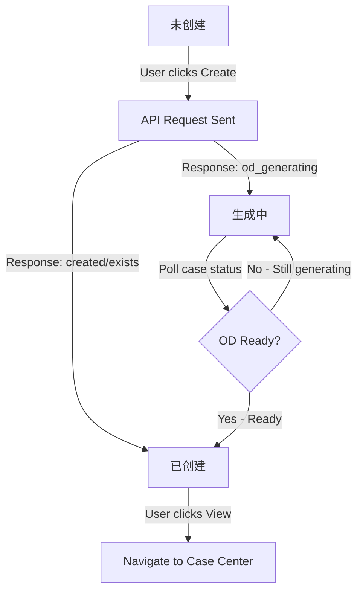

# Case Creation Status State Machine Design

**Date**: 2025-11-13
**Request**: openspec:apply - Improve case creation status flow
**Status**: Design Phase

---

## Current Issue

The previous implementation immediately navigates to the case simulation center after case creation. This has limitations:

1. **No visibility into status transitions** - User jumps away before seeing "生成中" status
2. **OD generation happens invisibly** - User doesn't know generation is happening in background
3. **Breaks workflow** - User has to go back to scenario browser to see final status
4. **No progress indication** - Can't see when OD generation completes

---

## Proposed Solution: Real-Time Status Updates

### Design Principle

**Stay on scenario browser page, update status in real-time**

After case creation:
1. Show success message with case ID
2. Update scenario list status column to show "生成中" or "已创建"
3. Start polling for OD generation progress
4. Show progress badge with live updates
5. Auto-navigate only when OD generation complete (if needed)

---

## State Machine Definition

### States

```
未创建 (Not Created)
  ↓ [Click Create] → Call API
生成中 (Generating)
  ├─ OD file generating
  ├─ [Poll every 3-5 sec] → Check case status
  └─ When OD ready
已创建 (Created)
  ├─ Case ready for simulation
  └─ [Optional] Auto-navigate to case center
    OR [Optional] User manually clicks to view
```

### Status Transitions Detail



### Status Value Mapping

| API Status | Display | Badge Color | Icon | Animation |
|-----------|---------|-------------|------|-----------|
| Not created | 未创建 | Gray | — | None |
| od_generating | 生成中 | Orange | ⏳ | Pulse |
| od_generation_failed | 生成失败 | Red | ⚠️ | None |
| created | 已创建 | Green | ✓ | None |
| simulating | 仿真中 | Blue | ▶️ | Pulse |
| completed | 已完成 | Cyan | ✅ | None |

---

## Detailed User Workflow

### Scenario 1: OD File Generating

**User Action**: Click Create button for scenario_123

**Step 1: API Call**
```javascript
directCreateCase('scenario_123', 'accident', 'VSS')
```

**Step 2: Backend Processing**
```
case_service.create_case_from_scenario()
  ├─ Create case structure
  ├─ Detect: OD is database reference
  ├─ Mark status: "od_generating"
  └─ Launch background thread for OD generation
  │   (Returns immediately without waiting)
  └─ Return API response:
     {
       case_id: "case_20251113_abc123",
       case_status: "od_generating",
       od_generation_started: true,
       od_file_status: "pending"
     }
```

**Step 3: Frontend Response**
```javascript
// 1. Show success alert
alert(`✓ 案例创建成功！\n案例 ID: case_20251113_abc123\n⏳ OD文件正在生成中...`)

// 2. Update scenarioCaseMap immediately
scenarioCaseMap['scenario_123'] = [
  {
    case_id: 'case_20251113_abc123',
    status: 'od_generating',
    created_at: now()
  }
]

// 3. Refresh scenario table
renderScenarios()
  // Table now shows: ⏳ 生成中 for scenario_123

// 4. Start polling for completion
startStatusPolling('case_20251113_abc123', 'scenario_123')
  // Every 3 seconds:
  // - Call GET /api/v1/case/{case_id}/status
  // - Check if status changed to 'created'
  // - If yes: Stop polling, update status badge

// 5. DO NOT navigate away
// User stays on scenario browser page
```

**Step 4: Background OD Generation (3-5 minutes)**
```
Backend daemon thread:
1. Call DataService.process_od_data()
2. Generate OD file from database
3. Update metadata.json: status = "created"
4. Return to main application
```

**Step 5: Frontend Status Update (Via Polling)**
```javascript
// Poll loop every 3-5 seconds:
const caseStatus = await fetch(`/api/v1/case/{case_id}/status`)
if (caseStatus.data.status === 'created') {
  // Stop polling
  clearInterval(pollInterval)

  // Update status badge
  scenarioCaseMap['scenario_123'][0].status = 'created'
  renderScenarios()

  // Show notification
  showNotification('✓ OD文件已生成，案例已就绪！', 'success')
}
```

**User Experience**
```
Timeline:
T+0:00  User clicks Create
        ↓ Dialog: "案例创建成功！案例ID: case_..."
T+0:01  Status column shows: "⏳ 生成中" (pulsing)
T+0:05  User sees progress still ongoing
T+3:45  [Background] OD generation completes
        Status column updates to: "✓ 已创建" (green)
        Notification: "✓ OD文件已生成，案例已就绪！"
T+3:46  User clicks status badge or "查看案例" link
        Navigates to case-simulation-center.html
```

### Scenario 2: OD File Already Exists

**User Action**: Click Create button for scenario_456 (has already created case)

**Step 1: Pre-creation Check**
```javascript
const existingCases = scenarioCaseMap['scenario_456'] || []
if (existingCases.length > 0) {
  // Show confirmation dialog
  confirm(`该场景已有案例\n\n` +
          `案例 ID: ${existingCase.case_id}\n` +
          `状态: ${getStatusDisplayName(existingCase.status)}`)
}
```

**Step 2: User Choice**
- **Option A**: Confirm → Navigate to existing case immediately
- **Option B**: Cancel → Create new case (continue)

---

## Implementation Architecture

### New Functions Required

#### 1. `startStatusPolling(caseId, scenarioId)`
```javascript
async function startStatusPolling(caseId, scenarioId, maxDuration = 600) {
  /**
   * Poll case status until it changes from "od_generating" to "created"
   * or timeout after maxDuration seconds
   *
   * @param caseId - Case ID to poll
   * @param scenarioId - Scenario ID (for updating badge)
   * @param maxDuration - Max polling time in seconds (default 600 = 10 min)
   */

  const startTime = Date.now()
  const pollInterval = setInterval(async () => {
    try {
      const response = await fetch(`/api/v1/case/${caseId}/status`)
      const caseData = await response.json()
      const newStatus = caseData.data?.status || caseData.status

      // Update map and UI
      if (scenarioCaseMap[scenarioId]) {
        scenarioCaseMap[scenarioId][0].status = newStatus
      }

      // Stop if status changed
      if (newStatus !== 'od_generating') {
        clearInterval(pollInterval)
        renderScenarios()

        // Show appropriate notification
        if (newStatus === 'created') {
          showNotification(
            '✓ 案例已就绪，OD文件生成完成！',
            'success'
          )
        } else if (newStatus === 'od_generation_failed') {
          showNotification(
            '⚠️ OD文件生成失败，请查看详情',
            'error'
          )
        }
      }

      // Timeout after maxDuration
      if ((Date.now() - startTime) / 1000 > maxDuration) {
        clearInterval(pollInterval)
        // Case still generating - that's ok, leave badge as is
      }
    } catch (error) {
      console.warn('Status polling error:', error)
      // Continue polling on error
    }
  }, 3000) // Poll every 3 seconds
}
```

#### 2. `showNotification(message, type)`
```javascript
function showNotification(message, type = 'info') {
  /**
   * Show a temporary notification toast
   *
   * @param message - Notification text
   * @param type - 'success' | 'error' | 'info' | 'warning'
   */

  const toast = document.createElement('div')
  toast.className = `notification notification-${type}`
  toast.textContent = message
  toast.style.cssText = `
    position: fixed;
    bottom: 20px;
    right: 20px;
    padding: 12px 20px;
    border-radius: 6px;
    background: ${getNotificationColor(type)};
    color: white;
    font-size: 14px;
    z-index: 10000;
    animation: slideIn 0.3s ease;
    box-shadow: 0 4px 12px rgba(0,0,0,0.15);
  `

  document.body.appendChild(toast)

  // Auto-remove after 5 seconds
  setTimeout(() => {
    toast.style.animation = 'slideOut 0.3s ease'
    setTimeout(() => toast.remove(), 300)
  }, 5000)
}

function getNotificationColor(type) {
  const colors = {
    'success': '#4CAF50',
    'error': '#f44336',
    'info': '#2196F3',
    'warning': '#ff9800'
  }
  return colors[type] || '#666'
}
```

#### 3. Enhanced `directCreateCase()` - Remove Navigation
```javascript
async function directCreateCase(scenarioId, eventType, strategy) {
  // ... existing code for scenario lookup and existence check ...

  try {
    // ... existing API call code ...

    const result = await response.json()
    const caseId = result.data?.case_id
    const caseStatus = result.data?.case_status
    const odFileStatus = result.data?.od_file_status
    const odGenerationStarted = result.data?.od_generation_started

    // CHANGED: Build appropriate success message
    let successMessage = `✓ 案例创建成功！\n案例 ID: ${caseId}`

    if (odFileStatus === 'pending' && odGenerationStarted) {
      successMessage += `\n\n⏳ OD文件正在生成中...\n系统已启动后台OD生成任务。\n（通常需要3-5分钟）`
    } else if (odFileStatus === 'exists') {
      successMessage += `\n✓ OD文件已就绪，案例可立即仿真`
    }

    // Show alert
    alert(successMessage)

    // Update scenarioCaseMap
    if (!scenarioCaseMap[scenarioId]) {
      scenarioCaseMap[scenarioId] = []
    }
    scenarioCaseMap[scenarioId].push({
      case_id: caseId,
      status: caseStatus || 'created',
      created_at: new Date().toISOString()
    })

    // Refresh table to show new status
    renderScenarios()

    // CHANGED: Start polling if OD generating
    if (caseStatus === 'od_generating') {
      startStatusPolling(caseId, scenarioId)
    }

    // REMOVED: window.location.href = `case-simulation-center.html?case_id=${caseId}`
    // User stays on scenario browser page
    // Restores button state
    if (btn) {
      btn.disabled = false
      btn.textContent = originalText
    }

  } catch (error) {
    // ... existing error handling ...
  }
}
```

### New CSS Required

```css
/* Notification toast styles */
@keyframes slideIn {
  from {
    transform: translateX(400px);
    opacity: 0;
  }
  to {
    transform: translateX(0);
    opacity: 1;
  }
}

@keyframes slideOut {
  from {
    transform: translateX(0);
    opacity: 1;
  }
  to {
    transform: translateX(400px);
    opacity: 0;
  }
}

.notification {
  animation: slideIn 0.3s ease;
}
```

### API Requirements

**New Endpoint Required** (if not exists):
```
GET /api/v1/case/{case_id}/status

Response:
{
  "case_id": "case_20251113_abc123",
  "status": "od_generating" | "created" | "od_generation_failed",
  "od_file_status": "pending" | "exists",
  "created_at": "2025-11-13T10:30:00Z",
  "last_updated": "2025-11-13T10:33:20Z"
}
```

If this endpoint doesn't exist, can use:
```
GET /api/v1/case/list_cases/?case_id=case_20251113_abc123
```

---

## Benefits of This Approach

### User Experience
✅ **Transparency** - See status changes in real-time
✅ **No interruption** - Don't jump away from scenario browser
✅ **Progress awareness** - Pulsing badge shows activity
✅ **Completion notification** - Know when ready without polling
✅ **Control** - User decides when to navigate to case center

### Technical
✅ **Non-blocking** - Background OD generation doesn't affect UI
✅ **Efficient polling** - 3-second interval, auto-stop
✅ **Graceful degradation** - Works even if polling fails
✅ **Backward compatible** - Existing workflows unaffected

---

## Implementation Sequence

### Phase 1: Remove Navigation (Current Step)
- [ ] Remove `window.location.href` from `directCreateCase()`
- [ ] Keep user on scenario browser page
- [ ] Refresh table to show new status immediately
- [ ] Show alert message with case ID

### Phase 2: Add Polling (Next Step)
- [ ] Implement `startStatusPolling()` function
- [ ] Auto-start polling if `od_generating` status
- [ ] Update badge when status changes
- [ ] Auto-stop polling on completion

### Phase 3: Add Notifications (Enhancement)
- [ ] Implement `showNotification()` function
- [ ] Show toast when OD generation completes
- [ ] Toast shows in bottom-right corner
- [ ] Auto-dismiss after 5 seconds

### Phase 4: Add Progress UI (Future)
- [ ] Show mini progress bar in status badge
- [ ] Show "X / 5 min elapsed" for OD generation
- [ ] Update every 10-30 seconds
- [ ] Requires backend endpoint for ETA

---

## Testing Checklist

### Manual Testing
- [ ] Create case with OD database reference
  - Verify: Status shows "⏳ 生成中"
  - Verify: Badge pulses
  - Verify: User stays on page
  - Verify: Can create other cases while waiting
- [ ] Wait for OD generation completion
  - Verify: Status changes to "✓ 已创建"
  - Verify: Notification appears
  - Verify: Polling stops automatically
- [ ] Create case with file-based OD
  - Verify: Status shows "✓ 已创建" immediately
  - Verify: No polling started
- [ ] Existing case scenario
  - Verify: Confirmation dialog appears
  - Verify: Can choose to view or create new

### Automated Testing (Future)
- [ ] Unit test: Status update logic
- [ ] Unit test: Polling start/stop
- [ ] E2E test: Full workflow
- [ ] Performance test: Polling doesn't block UI

---

## Deployment Notes

**No backend changes needed** - Uses existing APIs and status tracking

**Frontend files to update**:
- `frontend/scenarios/scenario_browser.js` - Main changes
- `frontend/scenarios/scenario_browser.css` - Add notification styles

**Backward compatibility**: 100% - Doesn't affect other pages or workflows

---

## Summary

This improvement changes the case creation experience from:

**Before (Immediate Navigation)**:
```
Create → Success Alert → Jump to Case Center → Miss "生成中" state
```

**After (Stay on Page + Real-Time Updates)**:
```
Create → Success Alert → ⏳ (Badge pulses) → [Polling] → ✓ (Notification) → Ready
```

Users can now see the full lifecycle of case creation and stay focused on the scenario browser page, with automatic status updates as the case becomes ready.

