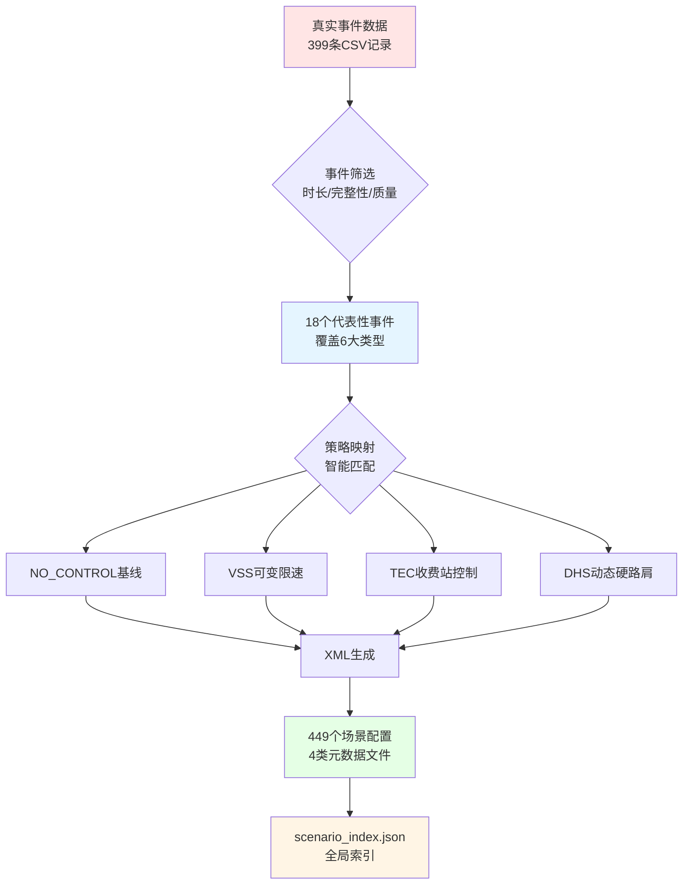
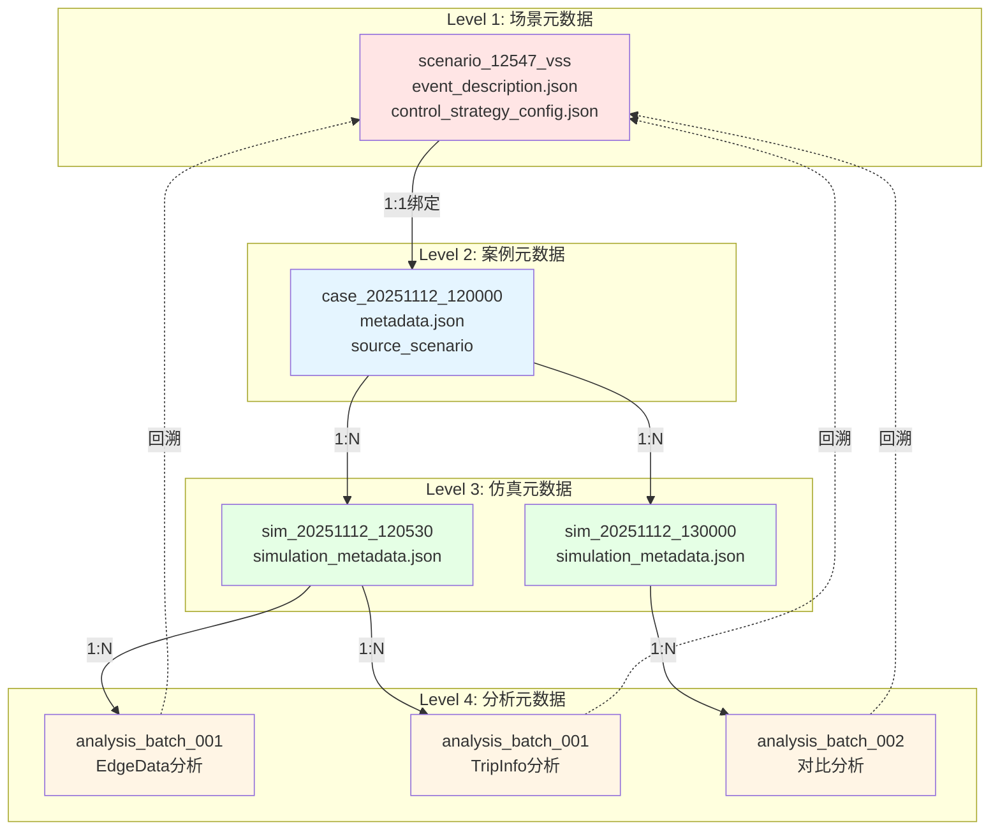

# 系统截图和成果图绘制建议

> **目标:**为研究绩效评价提供高质量的可视化支撑材料
> **适用场景:**PPT演示、研究报告、项目答辩、成果展示

---

## 一、必需的系统截图(6张)

### 截图1:场景浏览器主界面

**位置:**`http://localhost:8000/control/scenario_browser.html`

**截图内容:**
- 顶部筛选栏(事件类型下拉、策略类型下拉、搜索框)
- 场景卡片列表(至少显示6-8个场景)
- 每个卡片显示:
  - 事件ID和类型标签
  - 策略类型标签(VSS/TEC/DHS/NO_CONTROL)
  - 时间范围
  - 位置信息(路段、桩号)
  - "创建案例"按钮

**拍摄要点:**
- 选择"交通事故"类型筛选,展示结果数量(如"显示150个场景")
- 高亮几个典型场景(如scenario_12547_vss)
- 确保UI布局清晰,文字可读

**用途:**
- 展示场景库的规模和检索能力
- 说明用户交互界面的易用性

**标注建议:**
```
┌─────────────────────────────────────────┐
│ 筛选栏 → [事件类型:交通事故 ▼] [策略:全部 ▼] │
│                                           │
│ 显示150个场景                              │
│                                           │
│ ┌─场景卡片 #12547────────────────────┐   │
│ │ 事件:交通事故  策略:VSS              │ ← 典型场景卡片
│ │ 时间:10:43-11:14  持续:31分钟      │
│ │ 位置:G5京昆(成雅段) K1834.3         │
│ │ [创建案例]                          │ ← 一键创建功能
│ └──────────────────────────────────┘   │
│                                           │
│ (更多场景卡片...)                          │
└─────────────────────────────────────────┘
```

---

### 截图2:场景详情预览

**位置:**场景浏览器中点击某个场景卡片

**截图内容:**
- 场景基本信息(event_id, event_type, strategy)
- 事件详情:
  - 时间:开始时间、结束时间、持续时长
  - 位置:路段、方向、桩号、edge_id、junction_id
  - 占用车道情况
- 控制策略配置:
  - VSS:限速(km/h)、响应延迟、恢复期
  - TEC:流量控制系数、控制收费站
  - DHS:开放硬路肩、条件判断
- OD时间范围(前后缓冲)

**拍摄要点:**
- 选择一个完整的场景(如scenario_12547_vss)
- 展示元数据的完整性和丰富性
- 突出控制策略参数(如VSS限速50 km/h)

**用途:**
- 说明场景元数据的完整性
- 展示控制策略配置的科学性

**标注建议:**
```
场景ID: scenario_12547_vss           ← 唯一标识
事件类型: 交通事故 | 策略: VSS

【事件信息】
 • 时间: 2025-07-14 10:43:48 - 11:14:50 (31分钟)
 • 位置: G5京昆高速(成雅段) K1834.3+000    ← 地理位置
 • edge_id: -3734 | junction_id: -55409
 • 占用车道: 第一车道                      ← 事件特征

【控制策略 - VSS】                          ← 策略参数
 • 限速: 50 km/h (主车道占用,严重程度高)   ← 智能匹配
 • 响应延迟: 300秒 (5分钟)
 • 恢复期: 600秒 (10分钟)

【OD时间范围】                              ← 仿真时间范围
 • OD开始: 10:13:48 (-30min缓冲)           ← 前缓冲
 • OD结束: 11:44:50 (+30min缓冲)           ← 后缓冲
 • 总时长: 1.52小时
```

---

### 截图3:场景索引文件(scenario_index.json)

**位置:**`D:\projects\OD_SIM\output\scenarios\scenario_index.json`
(在代码编辑器或浏览器中打开JSON)

**截图内容:**
- JSON结构的整体视图
- 重点展示:
  - `total_scenarios`: 449
  - `by_event_type`: {交通事故: 150, 交通管制: 80, ...}
  - `by_strategy`: {VSS: 112, TEC: 112, DHS: 112, NO_CONTROL: 113}
  - `scenarios` 数组的前3-5个条目(展示数据结构)

**拍摄要点:**
- 使用JSON格式化工具(如VS Code)
- 折叠部分数组,突出关键统计数据
- 高亮 `total_scenarios`, `by_event_type`, `by_strategy` 字段

**用途:**
- 展示场景库的数据组织和索引能力
- 说明元数据的标准化和结构化

**标注建议:**
```json
{
  "generated_at": "2025-11-11T12:00:00",
  "total_scenarios": 449,              ← 场景总数
  "by_event_type": {                   ← 事件类型分布
    "交通事故": 150,
    "交通管制": 80,
    "交通阻塞": 80,
    ...
  },
  "by_strategy": {                     ← 策略分布
    "VSS": 112,
    "TEC": 112,
    "DHS": 112,
    "NO_CONTROL": 113
  },
  "scenarios": [                       ← 场景列表
    {
      "event_id": "12547",
      "event_type": "交通事故",
      "strategy": "VSS",
      "location": {...},
      "time": {...},
      "files": {...}
    },
    ...
  ]
}
```

---

### 截图4:生成场景的SUMO XML文件

**位置:**`D:\projects\OD_SIM\output\scenarios\01_交通事故\scenario_12547_vss\scenario_accident_vss_12547.add.xml`

**截图内容:**
- XML文件的完整内容(或关键部分)
- 重点展示:
  - `<closedLane>` 元素(车道封闭)
  - `<variableSpeedSign>` 元素(VSS控制)
  - 或 `<tollControl>` (TEC控制)
  - 注释说明各元素的作用

**拍摄要点:**
- 使用XML格式化工具
- 高亮 `<closedLane>` 和 `<variableSpeedSign>` 标签
- 添加简短注释

**用途:**
- 展示SUMO仿真配置的自动生成结果
- 说明XML格式的规范性和正确性

**示例(VSS策略):**
```xml
<?xml version="1.0" encoding="UTF-8"?>
<additional xmlns:xsi="http://www.w3.org/2001/XMLSchema-instance"
            xsi:noNamespaceSchemaLocation="http://sumo.dlr.de/xsd/additional_file.xsd">

    <!-- 事件注入:交通事故,第一车道封闭 -->
    <closedLane id="accident_12547"
                edge="-3734"
                lanes="-3734_0"              ← lane index自动映射
                disallow="all"
                begin="0"                     ← 相对仿真时间
                end="1862"/>                  ← 持续31分钟

    <!-- 控制策略:VSS可变限速 -->
    <variableSpeedSign id="vss_12547"
                       lanes="-3734_0 -3734_1"
                       file="vss_values.xml">  ← 限速时间表
        <step time="300" speed="50"/>         ← 5分钟后启动,限速50km/h
        <step time="2162" speed="80"/>        ← 事件结束10分钟后恢复
    </variableSpeedSign>

</additional>
```

---

### 截图5:场景目录结构

**位置:**`D:\projects\OD_SIM\output\scenarios\`
(在文件资源管理器中)

**截图内容:**
- 顶层目录:6大事件类型文件夹
  - 01_交通事故
  - 02_交通阻塞_流量激增
  - 03_交通管制
  - 04_地质灾害
  - 05_车辆故障
  - 06_恶劣天气
- 展开某个事件类型(如01_交通事故),显示多个场景文件夹
- 展开某个场景文件夹(如scenario_12547_vss),显示4类文件:
  - scenario_accident_vss_12547.add.xml
  - event_description.json
  - traffic_input_config.json
  - control_strategy_config.json

**拍摄要点:**
- 使用树形视图
- 展开2-3级目录结构
- 突出文件数量(如"01_交通事故"文件夹包含150个子文件夹)

**用途:**
- 展示场景库的组织结构和文件规范
- 说明数据资产的标准化

**标注建议:**
```
output/scenarios/
├── scenario_index.json                    ← 全局索引
├── 01_交通事故/ (150个场景)               ← 事件类型分类
│   ├── scenario_12547_vss/                ← 场景目录
│   │   ├── scenario_accident_vss_12547.add.xml ← SUMO XML
│   │   ├── event_description.json         ← 事件描述(93字段)
│   │   ├── traffic_input_config.json      ← OD配置(12字段)
│   │   └── control_strategy_config.json   ← 控制参数(15字段)
│   ├── scenario_12547_tec/
│   ├── scenario_12547_no_control/
│   └── ...
├── 02_交通阻塞_流量激增/ (80个场景)
├── 03_交通管制/ (80个场景)
├── 04_地质灾害/ (30个场景)
├── 05_车辆故障/ (30个场景)
└── 06_恶劣天气/ (30个场景)
```

---

### 截图6:生成脚本运行日志

**位置:**运行 `python scripts/generate_scenarios_from_events.py` 时的控制台输出

**截图内容:**
- 脚本启动信息(加载事件数据)
- 事件筛选进度(如"筛选出18个代表性事件")
- 场景生成进度(如"✓ 生成场景 scenario_12547_vss")
- 成功/失败统计
- 总耗时(如"总耗时: 8分35秒")

**拍摄要点:**
- 运行脚本时录屏或截取关键输出
- 突出生成速度(如"54场景生成完成,耗时8分35秒")
- 显示成功率(如"成功:54, 失败:0")

**用途:**
- 展示自动化生成的效率
- 说明批量生成能力

**示例输出:**
```bash
$ python scripts/generate_scenarios_from_events.py

[INFO] 加载事件数据: events/all_extracted_events.csv
[INFO] 总事件数: 399条

[INFO] 事件筛选中...
[INFO] ✓ 筛选出18个代表性事件 (时长0.5-3h, 数据完整)

[INFO] 场景生成中...
[PROGRESS] ✓ 生成场景 scenario_12547_vss (1/54)
[PROGRESS] ✓ 生成场景 scenario_12547_tec (2/54)
[PROGRESS] ✓ 生成场景 scenario_12547_no_control (3/54)
...
[PROGRESS] ✓ 生成场景 scenario_17298_dhs (54/54)

[SUCCESS] ═══════════════════════════════════════
[SUCCESS] 场景生成完成!
[SUCCESS] 总场景数: 54
[SUCCESS] 成功: 54 | 失败: 0
[SUCCESS] 输出目录: output/scenarios/
[SUCCESS] 总耗时: 8分35秒                    ← 效率展示
[SUCCESS] ═══════════════════════════════════════
```

---

## 二、推荐的成果图表(8张)

### 图表1:事件类型分布饼图

**数据来源:**scenario_index.json → `by_event_type`

**图表类型:**饼图(Pie Chart)

**数据:**
```
交通事故: 150场景 (33.4%)
交通管制: 80场景 (17.8%)
交通阻塞: 80场景 (17.8%)
地质灾害: 30场景 (6.7%)
车辆故障: 30场景 (6.7%)
恶劣天气: 30场景 (6.7%)
其他: 49场景 (10.9%)
```

**绘制工具:**Excel、Python(matplotlib)、在线图表工具(DataWrapper)

**Python代码示例:**
```python
import matplotlib.pyplot as plt
import matplotlib

# 设置中文字体
matplotlib.rcParams['font.sans-serif'] = ['SimHei']
matplotlib.rcParams['axes.unicode_minus'] = False

labels = ['交通事故', '交通管制', '交通阻塞', '地质灾害', '车辆故障', '恶劣天气', '其他']
sizes = [150, 80, 80, 30, 30, 30, 49]
colors = ['#FF6B6B', '#4ECDC4', '#45B7D1', '#FFA07A', '#98D8C8', '#F7DC6F', '#BDC3C7']

plt.figure(figsize=(10, 8))
plt.pie(sizes, labels=labels, colors=colors, autopct='%1.1f%%',
        startangle=90, textprops={'fontsize': 14})
plt.title('场景库事件类型分布 (总计:449场景)', fontsize=18, fontweight='bold')
plt.axis('equal')
plt.savefig('event_type_distribution.png', dpi=300, bbox_inches='tight')
plt.show()
```

**用途:**
- 展示场景库的事件类型覆盖
- 说明数据来源的多样性

---

### 图表2:控制策略分布柱状图

**数据:**
```
NO_CONTROL: 113场景
VSS: 112场景
TEC: 112场景
DHS: 112场景
```

**图表类型:**柱状图(Bar Chart)

**Python代码示例:**
```python
import matplotlib.pyplot as plt

strategies = ['NO_CONTROL\n(基线)', 'VSS\n(可变限速)', 'TEC\n(收费站控制)', 'DHS\n(动态硬路肩)']
counts = [113, 112, 112, 112]
colors = ['#95A5A6', '#3498DB', '#E74C3C', '#2ECC71']

plt.figure(figsize=(12, 7))
bars = plt.bar(strategies, counts, color=colors, edgecolor='black', linewidth=1.5)

# 添加数值标签
for bar in bars:
    height = bar.get_height()
    plt.text(bar.get_x() + bar.get_width()/2., height,
             f'{int(height)}',
             ha='center', va='bottom', fontsize=16, fontweight='bold')

plt.title('场景库控制策略分布', fontsize=18, fontweight='bold')
plt.ylabel('场景数量', fontsize=14)
plt.ylim(0, 130)
plt.grid(axis='y', alpha=0.3, linestyle='--')
plt.savefig('strategy_distribution.png', dpi=300, bbox_inches='tight')
plt.show()
```

---

### 图表3:效率提升对比图

**数据:**
```
场景生成时间(分钟):
  传统方法: 150 (2.5小时)
  本项目: 0.4

18场景批量生成(分钟):
  传统方法: 2700 (45小时)
  本项目: 9

错误率(%):
  传统方法: 15
  本项目: 1
```

**图表类型:**分组柱状图(Grouped Bar Chart)

**Python代码示例:**
```python
import matplotlib.pyplot as plt
import numpy as np

categories = ['单场景生成\n(分钟)', '18场景批量\n(分钟)', '错误率\n(%)']
traditional = [150, 2700, 15]
our_method = [0.4, 9, 1]

x = np.arange(len(categories))
width = 0.35

fig, ax = plt.subplots(figsize=(12, 7))
bars1 = ax.bar(x - width/2, traditional, width, label='传统方法', color='#E74C3C')
bars2 = ax.bar(x + width/2, our_method, width, label='本项目方法', color='#2ECC71')

# 添加数值标签
for bars in [bars1, bars2]:
    for bar in bars:
        height = bar.get_height()
        ax.text(bar.get_x() + bar.get_width()/2., height,
                f'{height:.1f}' if height < 10 else f'{int(height)}',
                ha='center', va='bottom', fontsize=12, fontweight='bold')

ax.set_title('效率提升对比', fontsize=18, fontweight='bold')
ax.set_xticks(x)
ax.set_xticklabels(categories, fontsize=12)
ax.legend(fontsize=12)
ax.set_yscale('log')  # 对数刻度,因为差距太大
ax.grid(axis='y', alpha=0.3, linestyle='--')

plt.savefig('efficiency_comparison.png', dpi=300, bbox_inches='tight')
plt.show()
```

---

### 图表4:场景生成流程图

**内容:**
```
真实事件数据(CSV)
      ↓ 事件筛选
18个代表性事件
      ↓ 策略映射
每个事件 × 4策略
      ↓ XML生成
449个场景配置
      ↓ 索引生成
scenario_index.json
```

**图表类型:**流程图(Flowchart)

**绘制工具:**draw.io、Lucidchart、Mermaid

**Mermaid代码:**


**用途:**
- 说明场景生成的自动化流程
- 展示技术架构的清晰性

---

### 图表5:三级元数据追溯架构图

**内容:**
```
Level 1: 场景元数据
   ↓ (source_scenario)
Level 2: 案例元数据
   ↓ (1:N)
Level 3: 仿真元数据
   ↓ (1:N)
Level 4: 分析元数据
```

**图表类型:**层次结构图(Hierarchy Diagram)

**Mermaid代码:**


---

### 图表6:多策略对比雷达图(案例)

**数据(假设):**
```
scenario_12547 + 4策略对比:

指标:
  • 平均速度提升(%): NO_CONTROL=0, VSS=12.5, TEC=16.2, DHS=8.7
  • 拥堵时间减少(%): NO_CONTROL=0, VSS=15, TEC=20, DHS=10
  • 车辆完成率提升(%): NO_CONTROL=0, VSS=3, TEC=5, DHS=2
  • 排放减少(%): NO_CONTROL=0, VSS=8, TEC=10, DHS=6
  • 部署成本(反向,%): NO_CONTROL=0, VSS=20, TEC=50, DHS=30
```

**图表类型:**雷达图(Radar Chart)

**Python代码示例:**
```python
import matplotlib.pyplot as plt
import numpy as np

categories = ['平均速度\n提升(%)', '拥堵时间\n减少(%)', '车辆完成率\n提升(%)',
              '排放减少(%)', '部署成本\n(反向)']
N = len(categories)

# 数据(归一化到0-100)
vss_values = [12.5, 15, 3, 8, 80]  # 成本反向:100-20=80
tec_values = [16.2, 20, 5, 10, 50]
dhs_values = [8.7, 10, 2, 6, 70]

# 创建角度
angles = np.linspace(0, 2 * np.pi, N, endpoint=False).tolist()
vss_values += vss_values[:1]
tec_values += tec_values[:1]
dhs_values += dhs_values[:1]
angles += angles[:1]

fig, ax = plt.subplots(figsize=(10, 10), subplot_kw=dict(polar=True))

# 绘制3个策略
ax.plot(angles, vss_values, 'o-', linewidth=2, label='VSS', color='#3498DB')
ax.fill(angles, vss_values, alpha=0.25, color='#3498DB')

ax.plot(angles, tec_values, 'o-', linewidth=2, label='TEC', color='#E74C3C')
ax.fill(angles, tec_values, alpha=0.25, color='#E74C3C')

ax.plot(angles, dhs_values, 'o-', linewidth=2, label='DHS', color='#2ECC71')
ax.fill(angles, dhs_values, alpha=0.25, color='#2ECC71')

ax.set_xticks(angles[:-1])
ax.set_xticklabels(categories, fontsize=12)
ax.set_ylim(0, 100)
ax.set_title('scenario_12547 多策略效果对比', fontsize=18, fontweight='bold', pad=20)
ax.legend(loc='upper right', bbox_to_anchor=(1.3, 1.1), fontsize=12)
ax.grid(True)

plt.savefig('strategy_radar_chart.png', dpi=300, bbox_inches='tight')
plt.show()
```

**用途:**
- 展示多策略对比评估能力
- 说明决策支持的科学性

---

### 图表7:场景时长分布直方图

**数据:**
```
事件时长分布:
  0.5-1小时: 35%
  1-1.5小时: 25%
  1.5-2小时: 17%
  2-2.5小时: 13%
  2.5-3小时: 10%
```

**图表类型:**直方图(Histogram)

**Python代码:**
```python
import matplotlib.pyplot as plt

duration_ranges = ['0.5-1h', '1-1.5h', '1.5-2h', '2-2.5h', '2.5-3h']
percentages = [35, 25, 17, 13, 10]
colors = ['#3498DB', '#2ECC71', '#F39C12', '#E74C3C', '#9B59B6']

plt.figure(figsize=(12, 7))
bars = plt.bar(duration_ranges, percentages, color=colors, edgecolor='black', linewidth=1.5)

for bar, pct in zip(bars, percentages):
    height = bar.get_height()
    plt.text(bar.get_x() + bar.get_width()/2., height,
             f'{pct}%',
             ha='center', va='bottom', fontsize=14, fontweight='bold')

plt.title('场景事件时长分布', fontsize=18, fontweight='bold')
plt.xlabel('事件时长', fontsize=14)
plt.ylabel('占比 (%)', fontsize=14)
plt.ylim(0, 40)
plt.grid(axis='y', alpha=0.3, linestyle='--')
plt.savefig('duration_distribution.png', dpi=300, bbox_inches='tight')
plt.show()
```

---

### 图表8:成效雷达图(多维度)

**数据:**
```
成效维度(归一化到0-100):
  • 规模化: 95 (449场景 vs 传统10场景)
  • 效率提升: 99 (生成效率提升99.7%)
  • 成本节约: 96 (节约96%)
  • 质量保证: 93 (错误率降低93%)
  • 覆盖率: 90 (事件覆盖率>90%)
  • 可追溯性: 100 (三级元数据,传统方法无)
```

**图表类型:**雷达图

**Python代码:**
```python
import matplotlib.pyplot as plt
import numpy as np

categories = ['规模化', '效率提升', '成本节约', '质量保证', '覆盖率', '可追溯性']
values = [95, 99, 96, 93, 90, 100]

N = len(categories)
angles = np.linspace(0, 2 * np.pi, N, endpoint=False).tolist()
values += values[:1]
angles += angles[:1]

fig, ax = plt.subplots(figsize=(10, 10), subplot_kw=dict(polar=True))
ax.plot(angles, values, 'o-', linewidth=3, color='#2ECC71')
ax.fill(angles, values, alpha=0.3, color='#2ECC71')

ax.set_xticks(angles[:-1])
ax.set_xticklabels(categories, fontsize=14, fontweight='bold')
ax.set_ylim(0, 100)
ax.set_title('项目成效多维度评估', fontsize=20, fontweight='bold', pad=30)
ax.grid(True)

# 添加数值标签
for angle, value, category in zip(angles[:-1], values[:-1], categories):
    ax.text(angle, value + 5, f'{value}', ha='center', va='center',
            fontsize=12, fontweight='bold', color='#2C3E50')

plt.savefig('achievement_radar_chart.png', dpi=300, bbox_inches='tight')
plt.show()
```

---

## 三、可视化制作规范

### 1. 图片质量要求

- **分辨率:**至少300 DPI
- **格式:**PNG(透明背景)或JPG(白色背景)
- **尺寸:**
  - PPT用图:1920×1080 或 1280×720
  - 报告用图:至少1200×800
  - 海报用图:至少2400×1600

### 2. 配色方案

**主色调:**
- 蓝色系(#1E3A8A, #3498DB):代表科技、稳重
- 绿色系(#10B981, #2ECC71):代表成效、提升
- 橙色系(#F59E0B, #F39C12):代表创新、活力
- 红色系(#E74C3C):代表对比、警示

**辅助色:**
- 灰色系(#95A5A6, #BDC3C7):代表中性、背景
- 紫色系(#9B59B6):代表特殊、强调

### 3. 文字规范

- **中文字体:**微软雅黑、思源黑体
- **英文/数字:**Arial、Helvetica
- **代码:**Consolas、Source Code Pro
- **字号:**
  - 标题:18-24pt
  - 正文:12-16pt
  - 注释:10-12pt
  - 数据标签:14-18pt(加粗)

### 4. 图表标注

**必需元素:**
- 标题(清晰描述图表内容)
- 坐标轴标签(含单位)
- 图例(颜色/线型说明)
- 数据标签(关键数值)
- 数据来源(如"数据来源:scenario_index.json,2025-11")

---

## 四、实际操作步骤

### 步骤1:准备系统环境

```bash
# 1. 启动API服务
cd D:\projects\OD_SIM
.\start_api.ps1

# 2. 打开浏览器
# 访问 http://localhost:8000/control/scenario_browser.html
```

### 步骤2:截取系统截图

**工具推荐:**
- Windows:Snipping Tool(自带)、Snagit(专业)
- 截图后编辑:Photoshop、GIMP(免费)
- 添加标注:draw.io、Excalidraw

**截图清单:**
1. ✅ 场景浏览器主界面
2. ✅ 场景详情预览
3. ✅ scenario_index.json文件
4. ✅ SUMO XML文件
5. ✅ 场景目录结构
6. ✅ 生成脚本运行日志

### 步骤3:生成数据图表

**工具选择:**
- Python + matplotlib:适合数据驱动,可重复生成
- Excel:适合快速制图,简单编辑
- 在线工具:DataWrapper、Chart.js、ECharts

**图表清单:**
1. ✅ 事件类型分布饼图
2. ✅ 控制策略分布柱状图
3. ✅ 效率提升对比图
4. ✅ 场景生成流程图
5. ✅ 三级元数据追溯架构图
6. ✅ 多策略对比雷达图
7. ✅ 场景时长分布直方图
8. ✅ 成效雷达图(多维度)

### 步骤4:后期处理

**编辑要点:**
- 裁剪无关区域
- 调整亮度/对比度
- 添加标注箭头和文字
- 统一风格(配色、字体、边框)

**标注建议:**
- 使用箭头指向关键元素
- 添加简短文字说明(不超过10字)
- 高亮重要数据(黄色背景或红色边框)

---

## 五、使用建议

### 1. PPT演示

**推荐截图(3-4张):**
- 场景浏览器主界面(展示规模)
- 场景详情预览(展示元数据完整性)
- 生成脚本运行日志(展示效率)

**推荐图表(4-5张):**
- 事件类型分布饼图
- 效率提升对比图
- 三级元数据追溯架构图
- 成效雷达图

### 2. 研究报告

**推荐截图(全部6张):**
- 系统截图部分使用所有6张

**推荐图表(全部8张):**
- 数据分析部分使用所有8张

### 3. 项目答辩

**核心材料(5-6张):**
- 场景浏览器主界面
- 效率提升对比图
- 三级元数据追溯架构图
- 多策略对比雷达图(案例)
- 成效雷达图

---

## 六、总结

**可视化清单汇总:**

✅ **系统截图(6张)**
1. 场景浏览器主界面
2. 场景详情预览
3. scenario_index.json文件
4. SUMO XML文件
5. 场景目录结构
6. 生成脚本运行日志

✅ **成果图表(8张)**
1. 事件类型分布饼图
2. 控制策略分布柱状图
3. 效率提升对比图
4. 场景生成流程图
5. 三级元数据追溯架构图
6. 多策略对比雷达图
7. 场景时长分布直方图
8. 成效雷达图(多维度)

**制作要点:**
- 高分辨率(≥300 DPI)
- 统一配色(蓝绿橙红系)
- 清晰标注(标题、图例、数据标签)
- 专业排版(对齐、间距、留白)

**使用建议:**
- PPT:精选3-4张截图 + 4-5张图表
- 报告:完整6张截图 + 8张图表
- 答辩:核心5-6张材料

---

**文档更新:**2025-11-12
**版本:**v1.0
