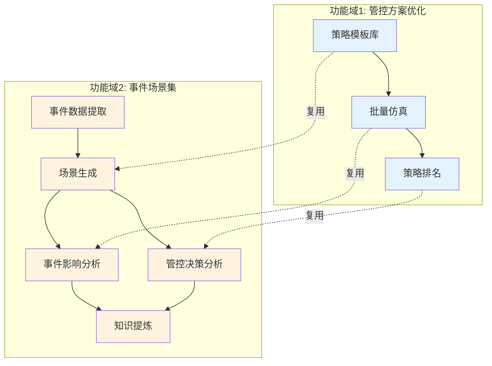
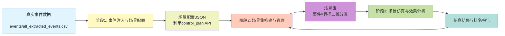
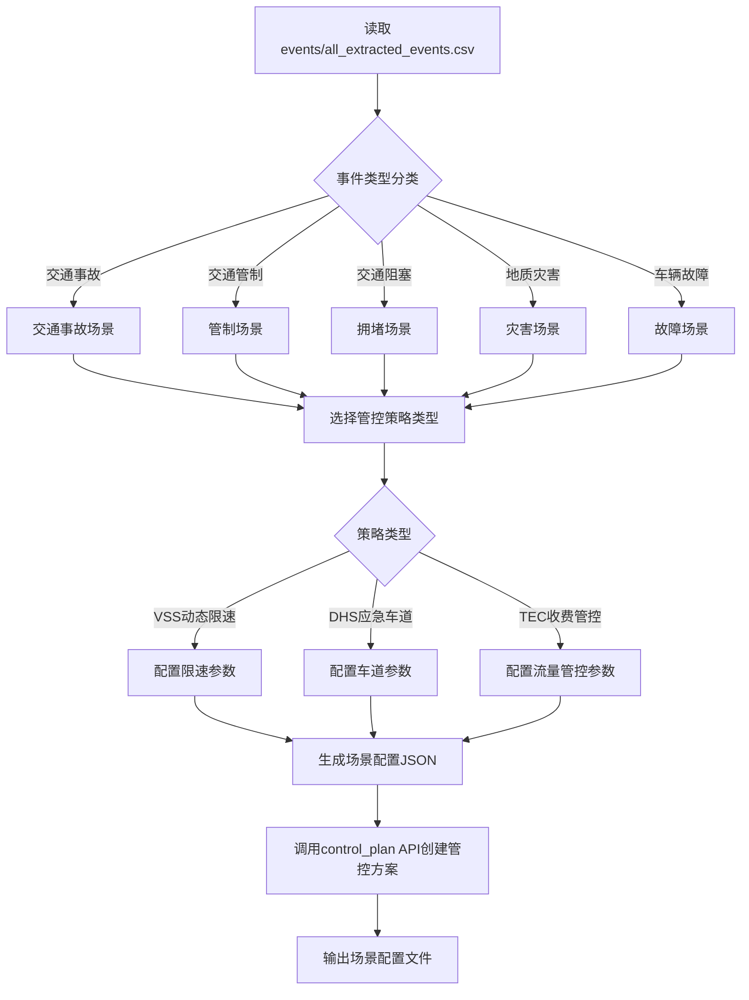
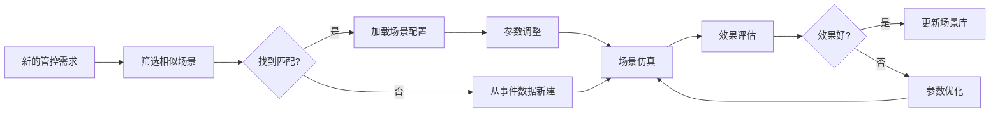
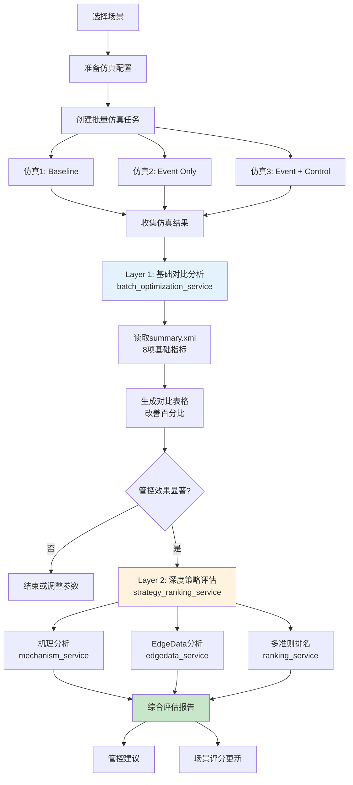
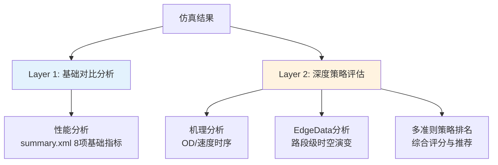
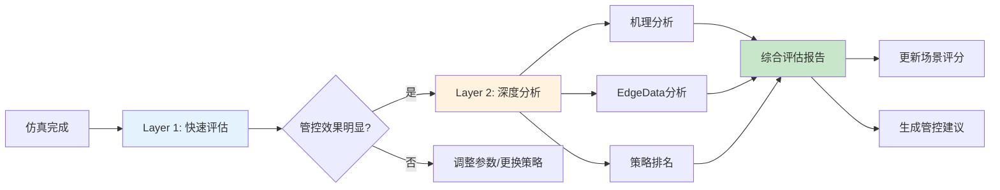
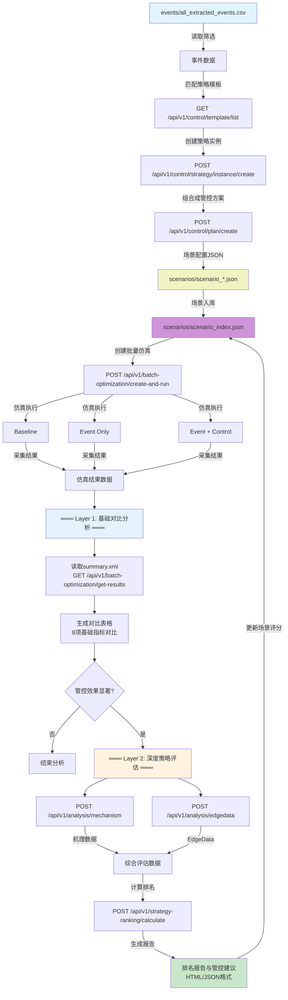
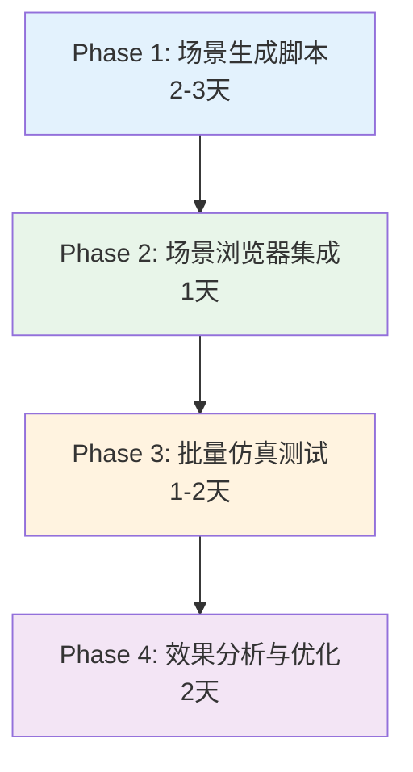
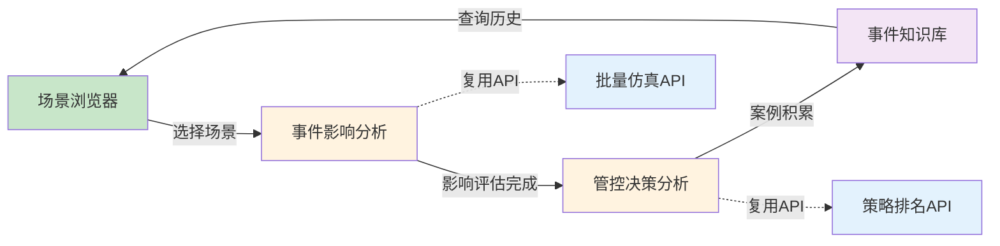

# 交通事件仿真推演场景集系统 - 简化工作流程

## 📋 项目概述

本项目是一个**基于真实事件的交通仿真推演场景集系统**，通过从真实交通事件数据中提取信息，结合管控策略，构建可复用的仿真场景库，评估管控效果，支撑管控决策优化。

---

## 🎯 两个功能域的区分

本系统包含两个**独立但可协同**的功能域：

### 功能域 1: 管控方案优化（已实现）

**目标**: 长周期交通运营管理优化

**应用场景**:

- 早晚高峰常态化管控
- 节假日交通管理
- 长期交通流优化

**已实现页面**:

- `frontend/control/simulations.html` - 批量仿真管理与监控
- `frontend/control/optimization.html` - 策略排名与优化
- `frontend/control/plan_management.html` - 管控方案管理

**核心功能**:

- ✅ 策略模板库
- ✅ 策略实例生成
- ✅ 管控方案创建
- ✅ 批量并行仿真
- ✅ 多准则策略排名

---

### 功能域 2: 事件场景集（本项目，待实现）

**目标**: 事件处置优化与知识提炼

**应用场景**:

- 交通事故应急处置
- 突发事件影响评估
- 管控决策效果分析
- 事件处置经验积累

**数据基础**:

- ✅ 已提取399个真实事件数据（`events/all_extracted_events.csv`）
- ✅ 100%空间匹配和管控信息匹配

**需要实现的页面**（本项目重点）:

1. ✅ **场景浏览器** (`frontend/scenarios/scenario_browser.html`) - 已完成
2. 🔄 **事件影响分析** (`frontend/scenarios/event_impact_analysis.html`) - 待开发
3. 🔄 **管控决策分析** (`frontend/scenarios/control_decision_analysis.html`) - 待开发
4. 🔄 **事件知识库** (`frontend/scenarios/event_knowledge_base.html`) - 待开发（可选）

---

## 📊 两个功能域的关系



**复用关系**：

- 事件场景生成可复用管控方案的策略模板
- 事件影响分析可复用批量仿真的执行引擎
- 管控决策分析可复用策略排名的分析算法

**独立性**：

- 页面独立：各有独立的前端页面
- 数据独立：各有独立的数据结构和存储
- 流程独立：各有独立的业务流程

**现有API支持**（两层架构）：

**管控与仿真**：

- `/api/v1/control/plan/*` - 管控方案创建与管理
- `/api/v1/simulation/*` - 仿真执行控制
- `/api/v1/batch-optimization/*` - 批量仿真优化

**Layer 1 (基础分析)**：

- `/api/v1/batch-optimization/get-results` - 获取批量仿真结果（summary.xml）

**Layer 2 (深度分析)**：

- `/api/v1/analysis/mechanism` - 机理分析（OD流量、速度时序）
- `/api/v1/analysis/edgedata` - EdgeData分析（路段级时空演变）
- `/api/v1/strategy-ranking/*` - 多准则策略效果排名

---

## 🔄 简化核心流程（三阶段）



**与现有管控仿真优化功能的集成**：

```
现有功能                    场景集系统应用
────────────               ──────────────────────
策略模板库    ─────→       事件类型与管控策略匹配
策略实例生成  ─────→       场景配置生成（事件参数+管控参数）
管控方案创建  ─────→       场景JSON配置
批量优化      ─────→       多场景批量仿真对比（baseline/无管控/有管控）
策略排名      ─────→       场景效果评估与最优策略推荐
分析工具      ─────→       性能、机理、EdgeData多维度分析
```

---

## 1️⃣ 阶段一: 事件注入与场景配置生成

### 目标

从已提取的真实事件数据中，筛选典型事件，配置管控策略，生成可仿真的场景配置文件。

### 输入数据

**主要来源**: `events/all_extracted_events.csv`

**数据规模**：

- **总事件数**: 399个
- **时间范围**: 2025-06-09 至 2025-11-02（约5个月）
- **平均持续时间**: 1.93小时
- **空间匹配率**: 100%（所有事件已完成junction_id/edge_id匹配）
- **管控信息完整度**: 100%

**事件类型分布**：

- **交通事故**: 261个 (65.4%) - 核心事件类型
- **车辆故障**: 52个 (13.0%)
- **交通管制**: 50个 (12.5%)
- **交通阻塞**: 30个 (7.5%)
- **地质灾害**: 2个 (0.5%)
- **其他**: 4个（火情、暴雨预警等）

**关键字段**：

```

- id: 事件ID
- report_id: 原始报告ID
- 类型: 事件类型（9种类型）
- 开始时间、结束时间: 事件时间范围
- 发生地点: 桩号位置
- 所在高速公路: 路段名称（覆盖G5、G76等多条高速）
- 车道方向、占用车道情况: 详细车道信息
- 伤亡情况: 人员伤亡统计
- junction_id, edge_id: 匹配的路网位置（100%完成）
- inc_lanes, int_lanes: 影响车道列表（100%完成）
- 管控开始时间、管控结束时间: 管控时段（100%完成）
- 管控收费站、管控范围: 管控位置信息（100%完成）
- 管控措施: 管控措施描述
- 上下行: 方向信息（上行144/下行161/双向94）
```

**事件-管控映射**：
所有399个事件已完成管控信息匹配，包括管控时间、收费站、范围等，可直接作为有管控场景案例基础数据。

### 处理流程



### 场景配置结构

利用现有的**管控方案格式**，每个场景包含：

```json
{
  "scenario_meta": {
    "scenario_id": "SC_EVT_001",
    "scenario_name": "京昆高速K1576交通事故+VSS限速管控",
    "event_source": "report_id: 12547",
    "scenario_category": "交通事故-动态限速(VSS)",
    "created_date": "2025-01-09"
  },
  "event_config": {
    "event_id": "12547",
    "event_type": "交通事故",
    "event_time": {
      "start": "2025-07-14 01:53:49",
      "end": "2025-07-14 03:22:39"
    },
    "location": {
      "stake": "K1576+000",
      "junction_id": "-35882",
      "edge_id": "-4688",
      "direction": "下行"
    },
    "impact": {
      "affected_lanes": ["应急车道"],
      "casualties": "暂无人员伤亡"
    }
  },
  "control_plan": {
    "plan_name": "事故上游VSS限速",
    "strategies": [
      {
        "strategy_type": "vss",
        "location": "事故上游1km路段",
        "activation_time": "事件开始前5分钟",
        "parameters": {
          "speed_limit": 60,
          "affected_edges": ["upstream_edge_ids"],
          "duration": "与事件同步"
        }
      }
    ]
  }
}
```

### 使用现有API

**1. 策略模板查询**

```
GET /api/v1/control/template/list?strategy_type=vss
```

**2. 创建策略实例**

```
POST /api/v1/control/strategy/instance/create
{
  "template_id": "vss_speed_limit_basic",
  "parameters": {...},
  "location_ids": ["edge_id_1", "edge_id_2"]
}
```

**3. 创建管控方案**

```
POST /api/v1/control/plan/create
{
  "plan_name": "scenario_sc_evt_001",
  "strategy_instance_ids": ["inst_001", "inst_002"],
  "coordination_config": {...}
}
```

### 输出数据

**格式**: JSON文件

**位置**: `output/scenarios/event_based/`

**命名规则**: `scenario_{event_type}_{control_type}_{event_id}.json`

**示例**:

- `scenario_accident_vss_12547.json` - 交通事故+VSS限速
- `scenario_congestion_dhs_12629.json` - 交通拥堵+应急车道开放
- `scenario_control_tec_12637.json` - 管制事件+收费站管控

### 典型场景映射

根据`数据集构建需求_原始.md`，需覆盖**6类事件 × 3类管控 = 18种场景类型**：

| 事件类型 ↓ / 管控策略 → | VSS 动态限速 | DHS 应急车道 | TEC 收费管控 | 可用事件数 |
|-------------------------|--------------|--------------|--------------|-----------|
| 交通事故                | ✅ 优先级高  | ✅ 优先级高  | -            | 261个     |
| 交通阻塞/流量激增       | ✅ 优先级高  | ✅ 优先级中  | ✅ 优先级高  | 30个      |
| 交通管制                | ✅ 优先级中  | -            | ✅ 优先级高  | 50个      |
| 地质灾害                | ✅ 优先级中  | -            | ✅ 优先级中  | 2个       |
| 车辆故障（危化品）      | ✅ 优先级中  | ✅ 优先级低  | ✅ 优先级低  | 52个      |
| 恶劣天气（暴雨）        | ✅ 优先级高  | -            | ✅ 优先级中  | 1个       |

**数据优势**：

- ✅ 所有事件均已完成空间匹配（junction_id、edge_id、车道信息）
- ✅ 所有事件均已完成管控信息匹配（管控时间、收费站、范围）
- ✅ 事件数量充足，可筛选最典型、最有代表性的案例
- ✅ 覆盖多条高速公路（G5京昆、G76厦蓉等）和多种场景

**从399个事件中筛选典型场景的策略**：

1. **数量充足性**: 交通事故(261个)、车辆故障(52个)、交通管制(50个)等类型数据充足
2. **空间匹配完整**: 100%完成junction_id/edge_id匹配，可直接用于仿真
3. **管控信息完整**: 100%包含管控时间、收费站等信息
4. **筛选优先级**:
   - 优先选择典型高速路段（G5京昆绵广段173个、G76厦蓉纳黔段88个）
   - 优先选择持续时间适中的事件（0.5-4小时，符合场景集需求）
   - 优先选择伤亡或影响明确的事件
   - 每种场景类型选择2-3个代表性案例，确保覆盖不同严重程度

---

## 2️⃣ 阶段二: 场景集构建与管理

### 目标

将生成的场景配置组织成结构化的场景库，按照事件类型和管控策略进行二维分类，支持快速检索和复用。

### 场景分类体系

**⚠️ 架构更新 (2025-11-11)**:
- ✅ 场景库仅存储场景定义（不含仿真配置和结果）
- ✅ 场景库是只读的（不包含 .sumocfg 文件和 results/ 目录）
- ✅ 仿真执行移至cases分支，使用**扁平结构**（`cases/{case_id}/simulations/scenario_{event_id}_{variant}/`）
- ✅ 命名约定区分场景模拟：`scenario_{id}_{variant}/` vs 常规模拟 `sim_{timestamp}_{type}/`
- ✅ metadata包含 `scenario_group` 字段用于关联同一事件的多个场景
- ✅ 文件命名仅用英文（SUMO兼容性）
- ✅ 每个场景独立metadata文件
- 📄 详见: `openspec/changes/add-event-scenario-sumo-configuration/ARCHITECTURE_CORRECTION.md`

---

**二维分类矩阵**（事件类型 × 管控策略）：

```
场景库结构 (output/scenarios/):
output/scenarios/
├── 01_accident/  ✏️ (英文目录名)
│   ├── scenario_12547_vss/  ✏️ (扁平化结构)
│   │   ├── scenario_accident_vss_12547.add.xml  ✏️ (SUMO additional文件，无中文)
│   │   ├── event_description.json
│   │   ├── traffic_input_config.json
│   │   ├── control_strategy_config.json
│   │   └── scenario_metadata.json  ✏️ (per-scenario)
│   ├── scenario_12547_no_control/  ✏️ NEW (仅事件，无控制)
│   │   ├── scenario_accident_event_12547.add.xml
│   │   ├── event_description.json
│   │   ├── traffic_input_config.json
│   │   └── scenario_metadata.json
│   └── scenario_12547_dhs/
│       ├── scenario_accident_dhs_12547.add.xml
│       └── scenario_metadata.json
├── 02_congestion/  ✏️ (英文)
│   ├── scenario_12837_vss/
│   └── scenario_12853_dhs/
├── 03_road_control/  ✏️ (英文)
│   └── scenario_12637_tec/
├── 04_geological/  ✏️ (英文)
│   └── scenario_13470_tec/
├── 05_breakdown/  ✏️ (英文)
└── 06_weather/  ✏️ (英文)
    └── scenario_13270_vss/

❌ 不再包含: simulation.sumocfg, results/ 目录
✅ 新增: per-scenario metadata, no_control 场景类型
```

**事件类型英文映射表**:

| 中文 | 英文 | 目录 |
|------|------|------|
| 交通事故 | accident | 01_accident |
| 交通阻塞 | congestion | 02_congestion |
| 交通管制 | road_control | 03_road_control |
| 地质灾害 | geological | 04_geological |
| 车辆故障 | breakdown | 05_breakdown |
| 恶劣天气 | weather | 06_weather |

**文件命名规范**:
```
scenario_{event_type}_{strategy}_{event_id}.add.xml

示例:
- scenario_accident_vss_12547.add.xml
- scenario_accident_event_12547.add.xml (no_control)
- scenario_congestion_tec_12837.add.xml
```

**仿真执行位置** (Cases分支 - 扁平结构):

**⚠️ 重要**: 使用扁平结构以保持与现有API的兼容性

```
cases/{case_id}/simulations/
├── sim_1028_093903_micro/          # 现有常规仿真（保持不变）
├── scenario_12547_baseline/        # 场景仿真: 基线（无事件、无管控）
│   ├── simulation.sumocfg          # SUMO配置（应用场景时生成）
│   ├── TAZ_6.add.xml              # 从config/复制
│   ├── e1/                         # E1检测器输出
│   ├── summary.xml                 # 直接存放，无results/子目录
│   ├── tripinfo.xml
│   └── simulation_metadata.json    # 包含 scenario_group: "12547"
├── scenario_12547_with_event/      # 场景仿真: 仅事件（无管控）
│   ├── simulation.sumocfg
│   ├── scenario_accident_event_12547.add.xml  # 从场景库复制
│   ├── TAZ_6.add.xml
│   ├── e1/
│   └── simulation_metadata.json    # 包含 scenario_group: "12547"
├── scenario_12547_vss/             # 场景仿真: 事件+VSS管控
│   ├── simulation.sumocfg
│   ├── scenario_accident_vss_12547.add.xml  # 从场景库复制
│   ├── TAZ_6.add.xml
│   ├── e1/
│   └── simulation_metadata.json    # 包含 scenario_group: "12547"
└── simulations_index.json
```

**命名约定**:
- 常规仿真: `sim_{timestamp}_{type}/` (现有模式)
- 场景仿真: `scenario_{event_id}_{variant}/`
  - `scenario_{id}_baseline` - 基线（无事件、无管控）
  - `scenario_{id}_with_event` - 仅事件（无管控）
  - `scenario_{id}_{strategy}` - 事件+管控策略 (vss/dhs/tec)

**关键设计**:
- ✅ 扁平结构保持现有API兼容性（`api/services/simulation_service.py` 不需修改）
- ✅ 命名约定清晰区分场景仿真和常规仿真
- ✅ `scenario_group` 元数据字段关联同一事件的多个变体
- ✅ 每个目录都是独立可运行的仿真

### 场景元数据索引

**索引文件**: `scenarios/scenario_index.json`

```json
{
  "scenarios": [
    {
      "scenario_id": "SC_EVT_001",
      "scenario_name": "京昆高速K1576交通事故+VSS限速管控",
      "event_type": "交通事故",
      "control_strategy": "VSS",
      "source_event_id": "12547",
      "road": "G5京昆高速（绵广段）",
      "location": "K1576+000",
      "direction": "下行",
      "created_date": "2025-01-09",
      "file_path": "scenarios/01_交通事故/vss/scenario_accident_vss_12547.json",
      "tags": ["货车追尾", "应急车道", "夜间事故"],
      "effectiveness_score": null,  // 仿真后填充
      "simulation_count": 0
    }
  ],
  "statistics": {
    "total_scenarios": 18,
    "by_event_type": {
      "交通事故": 5,
      "交通阻塞_流量激增": 4,
      "交通管制": 3,
      "地质灾害": 1,
      "车辆故障_危化品": 2,
      "恶劣天气_暴雨": 3
    },
    "by_control_strategy": {
      "VSS": 8,
      "DHS": 5,
      "TEC": 5
    }
  }
}
```

### 场景验证规则

在场景入库前，需通过以下验证：

1. **配置完整性检查**
   - 事件配置必填项齐全
   - 管控方案参数合法
   - 位置信息有效（junction_id/edge_id存在于路网）

2. **时空一致性检查**
   - 管控启动时间 ≤ 事件开始时间
   - 管控位置与事件位置匹配（上游/同位置/下游）
   - 管控持续时间 ≥ 事件持续时间

3. **管控策略合理性**
   - VSS限速值范围：20-120 km/h
   - DHS车道类型与路网匹配
   - TEC收费站ID存在于路网

**验证API**:

```
POST /api/v1/scenario/validate
{
  "scenario_config": {...}
}
```

### 场景检索功能

**多维度筛选**：

- 按事件类型筛选
- 按管控策略筛选
- 按路段/收费站筛选
- 按时间范围筛选
- 按关键词搜索（标签/描述）

**API示例**:

```
GET /api/v1/scenario/search?event_type=交通事故&control_strategy=VSS&road=G5
```

### 场景复用流程



---

## 3️⃣ 阶段三: 场景仿真与效果分析

### 目标

对场景进行批量仿真，对比分析不同管控策略的效果，生成排名报告和管控建议。

### 仿真对比方案

**三种仿真配置对比**：

| 仿真方案 | 说明 | 配置 |
|---------|------|------|
| Baseline | 无事件无管控 | 正常交通流 |
| Event Only | 有事件无管控 | 注入事件，不启用管控策略 |
| Event + Control | 有事件有管控 | 注入事件，启用管控策略 |

**使用现有的批量优化API**:

```
POST /api/v1/batch-optimization/create-and-run
{
  "case_id": "case_001",
  "base_plan_name": "baseline_plan",
  "scenarios": [
    {
      "scenario_id": "SC_EVT_001",
      "control_plan_name": "scenario_sc_evt_001"
    }
  ],
  "optimization_config": {
    "compare_baseline": true,
    "compare_no_control": true
  }
}
```

### 仿真执行流程（两层分析）



### 分析维度（两层架构）

场景分析采用两层架构，类似于管控方案分析体系：



---

#### Layer 1: 基础对比分析（快速评估）

**目的**: 快速对比三种仿真方案的基础性能指标

**调用API**: `POST /api/v1/batch-optimization/get-results`

**数据来源**: `summary.xml`（SUMO标准输出）

**核心指标**（8项）：

- 平均速度（km/h）
- 平均行程时间（s）
- 总延误时间（车·秒）
- 通行能力（veh/h）
- 完成车辆数（veh）
- 平均等待时间（s）
- 总行驶距离（km）
- 系统总时间（车·小时）

**对比计算**：

```
事件影响 = (Event Only - Baseline) / Baseline × 100%
管控效果 = (Event + Control - Event Only) / Event Only × 100%
净改善 = (Event + Control - Baseline) / Baseline × 100%
```

**输出形式**：

- 对比表格（显示三种方案的指标值）
- 改善百分比（相对baseline和event only）
- 快速判断：管控是否有效

**优势**：

- ✅ 数据直接来自summary.xml，无需额外计算
- ✅ 分析速度快（秒级）
- ✅ 适合快速筛选和初步评估

---

#### Layer 2: 深度策略评估（详细分析）

**目的**: 深入分析管控策略的作用机理、空间影响范围和综合效果

**前置条件**: Layer 1分析完成后，用户选择进入详细分析

##### 2.1 机理分析（Mechanism Analysis）

**调用API**: `POST /api/v1/analysis/mechanism`

**数据来源**: `tripinfo.xml`, `vehroute.xml`

**分析内容**：

- **OD流量对比**: 各OD对的流量变化（baseline vs control）
- **速度时间序列**: 关键路段速度随时间演化
- **路径选择变化**: 管控前后车辆路径分布

**输出形式**：

- OD流量对比表
- 速度时序曲线图
- 路径变化热力图

**适用场景**: 理解管控策略如何改变交通流特征

---

##### 2.2 EdgeData分析（Edge-Level Analysis）

**调用API**: `POST /api/v1/analysis/edgedata`

**数据来源**: `edgedata.xml`（需在仿真配置中启用）

**分析内容**：

- **路段级速度分布**: 每条道路的速度变化
- **占有率时空变化**: 拥堵的时空传播过程
- **拥堵传播范围**: 管控前后拥堵影响范围对比

**输出形式**：

- 路段速度热力图
- 时空演变动画
- 拥堵范围对比图

**适用场景**: 评估管控策略的空间影响范围和时间演变特征

---

##### 2.3 多准则策略排名（Strategy Ranking）

**调用API**: `POST /api/v1/strategy-ranking/calculate`

**数据来源**: 综合Layer 1和Layer 2.1/2.2的分析结果

**分析内容**：

**评估维度**（四个准则）：

| 维度 | 权重 | 计算方式 | 数据来源 | 说明 |
|------|------|---------|---------|------|
| 有效性 (Effectiveness) | 40% | 延误减少量 + 速度改善率 | Layer 1 指标 | 管控是否显著改善交通状况 |
| 覆盖性 (Coverage) | 25% | 影响范围缩减率 | EdgeData分析 | 管控是否控制了拥堵传播 |
| 效率性 (Efficiency) | 20% | 通行能力恢复率 | Layer 1 指标 | 管控是否快速恢复通行能力 |
| 可靠性 (Reliability) | 15% | 性能稳定性指标 | 多次仿真方差 | 管控效果是否稳定可靠 |

**评分公式**：

```
总分 = 有效性 × 0.4 + 覆盖性 × 0.25 + 效率性 × 0.2 + 可靠性 × 0.15
```

**推荐等级**：

- 🥇 **一级推荐** (总分 ≥ 85): 强烈推荐实际应用
- 🥈 **二级推荐** (总分 70-84): 建议试用
- 🥉 **三级推荐** (总分 < 70): 需要参数优化

**输出形式**：

- 策略排序表（按总分排序）
- 多维度雷达图（四个准则的可视化对比）
- 详细评估报告（HTML格式）
- 管控建议和优化方向

**使用API**:

```
POST /api/v1/strategy-ranking/calculate
{
  "batch_id": "batch_001",
  "ranking_criteria": {
    "effectiveness_weight": 0.4,
    "coverage_weight": 0.25,
    "efficiency_weight": 0.2,
    "reliability_weight": 0.15
  }
}
```

---

### 两层分析的工作流程



**使用建议**：

1. **所有场景都需要Layer 1分析** - 快速筛选有效的管控策略
2. **效果显著的场景进入Layer 2** - 深入理解作用机理和影响范围
3. **Layer 2数据用于优化参数** - 基于机理分析调整管控参数

**优势**：

- ✅ 分层设计，节省计算资源（不是所有场景都需要Layer 2）
- ✅ 快速反馈（Layer 1秒级响应）
- ✅ 深度分析（Layer 2提供完整的策略评估）
- ✅ 可扩展性（Layer 2可独立添加新的分析模块）

### 排名报告输出

**报告结构**：

```json
{
  "report_meta": {
    "report_id": "RPT_20250109_001",
    "generated_at": "2025-01-09T10:30:00",
    "scenario_count": 18
  },
  "overall_ranking": [
    {
      "rank": 1,
      "scenario_id": "SC_EVT_005",
      "scenario_name": "交通阻塞+DHS应急车道开放",
      "total_score": 92.5,
      "scores": {
        "effectiveness": 95,
        "coverage": 88,
        "efficiency": 90,
        "reliability": 94
      },
      "key_improvements": {
        "delay_reduction": "35%",
        "speed_improvement": "+28 km/h",
        "congestion_range_reduction": "45%"
      }
    }
  ],
  "by_event_type": {
    "交通事故": {
      "best_strategy": "DHS+VSS组合",
      "avg_score": 85.2
    }
  },
  "by_control_strategy": {
    "VSS": {
      "avg_score": 82.5,
      "best_scenario": "SC_EVT_012"
    }
  },
  "recommendations": [
    {
      "scenario_category": "交通事故-高速主线",
      "recommended_strategy": "应急车道开放(DHS) + 上游限速(VSS)",
      "reason": "可快速疏导车流，同时减少二次事故风险",
      "confidence": "高"
    }
  ]
}
```

### 可视化输出

**生成图表类型**：

1. **雷达图**：多维度评分对比
2. **柱状图**：不同场景效果对比
3. **热力图**：路网速度/拥堵分布
4. **时序图**：关键指标演化趋势

**API**:

```
GET /api/v1/strategy-ranking/report/{report_id}/visualizations
```

### 管控建议生成

**基于排名结果，自动生成管控建议**：

```
IF 某事件类型 + 某管控策略组合的平均分 > 85 THEN
    推荐: "该组合效果优秀，建议作为标准方案"

IF 速度改善率 > 30% AND 延误减少量 > 20% THEN
    推荐: "显著改善交通状况，建议实际应用"

IF 影响范围缩减率 < 15% THEN
    建议: "管控效果有限，建议调整参数或更换策略"

IF 通行能力恢复率 > 80% THEN
    推荐: "快速恢复通行能力，适合应急管控"
```

---

## 🔁 完整数据流与API调用链（两层架构）



**关键API端点说明**：

### Layer 1 API

| API端点 | 方法 | 功能 | 响应时间 |
|---------|------|------|---------|
| `/api/v1/batch-optimization/create-and-run` | POST | 创建并启动批量仿真 | 立即返回batch_id |
| `/api/v1/batch-optimization/get-results` | GET | 获取批量仿真结果（summary.xml数据） | < 1秒 |

### Layer 2 API

| API端点 | 方法 | 功能 | 响应时间 |
|---------|------|------|---------|
| `/api/v1/analysis/mechanism` | POST | 机理分析（OD/速度时序） | 5-10秒 |
| `/api/v1/analysis/edgedata` | POST | EdgeData分析（路段级） | 10-30秒 |
| `/api/v1/strategy-ranking/calculate` | POST | 多准则策略排名 | 2-5秒 |
| `/api/v1/strategy-ranking/report/{batch_id}` | GET | 获取排名报告 | < 1秒（缓存） |

---

## 📁 项目目录结构（简化）

```
OD_SIM/
├── events/                             # 事件数据
│   └── all_extracted_events.csv        # 已提取的事件数据（含管控匹配）
├── output/
│   └── scenarios/                      # 场景集
│       ├── scenario_index.json         # 场景索引
│       ├── 01_交通事故/
│       │   ├── vss/
│       │   ├── dhs/
│       │   └── tec/
│       ├── 02_交通阻塞_流量激增/
│       ├── 03_交通管制/
│       ├── 04_地质灾害/
│       ├── 05_车辆故障_危化品/
│       └── 06_恶劣天气_暴雨/
├── cases/                              # 仿真案例
│   └── {case_id}/
│       ├── simulations/                # 批量仿真结果
│       └── analysis/                   # 分析结果
├── control_data/                       # 管控配置（现有）
│   ├── strategies/                     # 策略模板库
│   ├── instances/                      # 策略实例
│   └── plans/                          # 管控方案
├── docs/
│   ├── scenarios_library/              # 场景集文档
│   │   ├── PROJECT_WORKFLOW.md         # 本文档
│   │   └── 数据集构建需求_原始.md
│   └── control_workflow/               # 管控工作流文档（现有）
└── api/                                # API服务（现有）
    ├── routes/
    │   ├── control_plan_routes.py
    │   ├── batch_optimization_routes.py
    │   └── strategy_ranking_routes.py
    └── services/
        ├── control_plan_service.py
        ├── batch_optimization_service.py
        └── strategy_ranking_service.py
```

---

## 🚀 快速开始示例

### 示例1: 从真实事件创建场景并仿真

**前置条件**：

```bash
# 激活conda环境
conda activate od_project

# 确保依赖已安装
mamba install -y pandas requests
```

**步骤1: 从CSV选择典型事件**

```python
import pandas as pd

# 读取事件数据（399个事件）

print(f"总事件数: {len(events)}")

# 筛选：交通事故 + 有junction_id + 有管控

# 交通事故有261个，100%已完成空间匹配和管控信息匹配

    (events['类型'] == '交通事故') &
    (events['junction_id'].notna()) &
    (events['管控开始时间'].notna())
]
print(f"符合条件的交通事故: {len(accident_events)}个")

# 选择第一个典型事件

print(f"事件ID: {event['report_id']}")
print(f"位置: {event['发生地点']}, junction_id: {event['junction_id']}")
print(f"时间: {event['开始时间']} - {event['结束时间']}")
print(f"高速公路: {event['所在高速公路']}")
print(f"占用车道: {event['占用车道情况']}")
```

**步骤2: 创建管控策略实例**

```python
import requests

# 创建VSS策略实例

    "template_id": "vss_speed_limit_basic",
    "instance_name": f"vss_evt_{event['report_id']}",
    "parameters": {
        "speed_limit": 60,
        "activation_time": -300,  # 事件前5分钟
        "duration": 7200  # 2小时
    },
    "location_config": {
        "edge_ids": [event['edge_id']],
        "junction_ids": [event['junction_id']]
    }
})
instance_id = response.json()['instance_id']
```

**步骤3: 创建管控方案**

```python
response = requests.post('http://localhost:8000/api/v1/control/plan/create', json={
    "plan_name": f"scenario_accident_vss_{event['report_id']}",
    "description": f"交通事故管控场景 - {event['发生地点']}",
    "strategy_instance_ids": [instance_id]
})
plan_name = response.json()['plan_name']
```

**步骤4: 批量仿真（Baseline/Event Only/Event+Control）**

```python
response = requests.post('http://localhost:8000/api/v1/batch-optimization/create-and-run', json={
    "case_id": "case_001",
    "batch_name": f"batch_evt_{event['report_id']}",
    "scenarios": [
        {
            "scenario_name": f"scenario_{event['report_id']}",
            "control_plan_name": plan_name
        }
    ],
    "config": {
        "compare_baseline": True,
        "compare_no_control": True
    }
})
batch_id = response.json()['batch_id']
```

**步骤5: 查看排名报告**

```python
response = requests.post(f'http://localhost:8000/api/v1/strategy-ranking/calculate', json={
    "batch_id": batch_id
})
ranking_report = response.json()
print(f"管控效果评分: {ranking_report['overall_ranking'][0]['total_score']}")
print(f"延误减少: {ranking_report['overall_ranking'][0]['key_improvements']['delay_reduction']}")
```

---

### 示例2: 批量构建场景集

**前置条件**：

```bash
# 激活conda环境
conda activate od_project
```

**从399个事件中批量生成典型场景**:

```python
import pandas as pd
import requests

# 读取事件数据（399个）

print(f"总事件数: {len(events)}")
print(f"事件类型分布:")
print(events['类型'].value_counts())

# 定义场景映射规则（事件类型 → 管控策略）

    '交通事故': ['vss', 'dhs'],        # 261个事件可选
    '交通阻塞': ['vss', 'dhs', 'tec'], # 30个事件可选
    '交通管制': ['vss', 'tec'],        # 50个事件可选
    '地质灾害': ['tec'],               # 2个事件可选
    '车辆故障': ['vss', 'tec'],        # 52个事件可选
    '恶劣天气': ['vss', 'tec']         # 需要从交通管制或其他类型中提取
}

scenario_configs = []

# 按事件类型分组筛选

    # 筛选该类型事件（所有事件100%已完成空间匹配）
    filtered = events[events['类型'].str.contains(event_type)]

    print(f"\n处理事件类型: {event_type}, 可用事件数: {len(filtered)}")

    # 为每种管控策略选择2-3个代表案例
    for strategy in strategies:
        # 优先选择有明确管控记录的事件（所有事件100%有管控信息）
        candidates = filtered.copy()

        # 进一步筛选：持续时间适中（0.5-4小时）
        if len(candidates) > 0:
            # 计算持续时间（小时）
            candidates['duration_hours'] = (
                pd.to_datetime(candidates['结束时间']) -
                pd.to_datetime(candidates['开始时间'])
            ).dt.total_seconds() / 3600

            # 筛选持续时间适中的事件
            candidates = candidates[
                (candidates['duration_hours'] >= 0.5) &
                (candidates['duration_hours'] <= 4.0)
            ]

            # 按高速公路分组，优先选择G5京昆和G76厦蓉
            priority_roads = ['G5京昆高速（绵广段）', 'G76厦蓉高速（纳黔段）']
            priority_events = candidates[candidates['所在高速公路'].isin(priority_roads)]

            # 选择前2-3个典型案例
            num_scenarios = min(3, len(candidates))
            if len(priority_events) > 0:
                selected = priority_events.head(num_scenarios)
            else:
                selected = candidates.head(num_scenarios)

            for _, event in selected.iterrows():
                # 创建场景配置
                scenario = {
                    'event_type': event_type,
                    'strategy': strategy,
                    'report_id': event['report_id'],
                    'location': event['发生地点'],
                    'road': event['所在高速公路'],
                    'duration': event['duration_hours']
                }
                scenario_configs.append(scenario)

                print(f"  ✅ 选择事件: {event['report_id']} - {event['所在高速公路']} "
                      f"K{event['发生地点']}, 持续{event['duration_hours']:.1f}小时")

print(f"\n场景集构建完成！")
print(f"从399个事件中筛选出 {len(scenario_configs)} 个典型场景")
print(f"覆盖 {len(scenario_mapping)} 种事件类型")
```

---

## 📊 预期成果

### 场景集规模

**目标**: 覆盖 6类事件 × 3类管控 = 至少18个典型场景

**数据基础（强大）**:

- ✅ **399个真实事件记录**已提取（`events/all_extracted_events.csv`）
  - 交通事故: 261个
  - 车辆故障: 52个
  - 交通管制: 50个
  - 交通阻塞: 30个
  - 地质灾害: 2个
  - 其他: 4个
- ✅ **100%空间匹配完成**（junction_id、edge_id、车道信息全部完成）
- ✅ **100%管控信息完成**（管控时间、收费站、范围全部完成）
- ✅ **时间跨度充足**（2025-06-09 至 2025-11-02，约5个月）
- ✅ **地理覆盖广**（G5京昆、G76厦蓉等10条高速公路）

**当前进度**:

- ✅ 事件数据已提取（399条完整记录，质量优秀）
- 🔄 场景配置生成（待开发自动化脚本，可从399个事件中筛选最佳案例）
- 📋 场景集组织（待建立二维分类索引）
- 📋 批量仿真执行（利用现有batch_optimization API）
- 📋 排名报告生成（利用现有strategy_ranking API）

**优势**：
有了399个高质量事件数据，可以：

1. 筛选最典型、最有代表性的案例
2. 每种场景类型选择多个不同严重程度的案例
3. 建立更全面的场景库（不止18个，可扩展到50+场景）
4. 支持按路段、时段、严重程度等多维度筛选

### 应用价值

1. **快速决策支持**
   - 新事件发生时，从场景集检索相似案例
   - 直接应用验证过的管控策略
   - 30分钟内完成从决策到仿真验证

2. **管控策略优化**
   - 基于真实事件的策略效果数据库
   - 不同事件-管控组合的排名和建议
   - 持续优化管控参数

3. **培训和研究**
   - 典型场景案例库
   - 管控策略效果演示
   - 研究报告和论文支撑

---

## 📖 相关文档

- [管控工作流程文档](../control_workflow/README.md) - 策略模板、实例生成、方案创建、优化方法
- [数据集构建需求](数据集构建需求_原始.md) - 场景集数据结构和需求说明
- [API文档](../api_docs/) - 完整的API接口文档
- [批量优化指南](../api_docs/batch_optimization_api.md) - 批量仿真和优化流程
- [策略排名算法](../control_strategies/方案自动生成算法研究报告.md) - 排名评分算法说明

---

## 🔧 开发实施指南

本章节提供清晰的开发流程、需要开发的脚本和页面，以及详细的开发指导。

---

## 📋 开发流程总览



**总开发时间**: 6-8天

---

## 🎯 Phase 1: 场景生成脚本开发（优先级：最高）

### 目标

从399个事件中筛选18-30个典型场景，生成场景配置JSON和索引文件。

### 需要开发的脚本

#### 1. 主脚本: `scripts/generate_scenarios_from_events.py`

**功能**：

- 读取 `events/all_extracted_events.csv`
- 按照事件类型×管控策略映射筛选
- 生成场景配置JSON文件
- 调用control_plan API创建管控方案
- 生成 `scenario_index.json` 索引文件

**前置条件**：

```bash
# 激活conda环境
conda activate od_project

# 安装依赖（如未安装）
mamba install -y pandas requests
```

**开发步骤**：

```python
# scripts/generate_scenarios_from_events.py

import pandas as pd
import json
import requests
from pathlib import Path
from datetime import datetime

# ========== 步骤1: 读取和筛选事件 ==========
def load_and_filter_events():
    """
    读取事件数据并按规则筛选
    返回: 筛选后的事件DataFrame
    """
    events = pd.read_csv('events/all_extracted_events.csv', encoding='utf-8-sig')

    # 计算持续时间
    events['duration_hours'] = (
        pd.to_datetime(events['结束时间']) -
        pd.to_datetime(events['开始时间'])
    ).dt.total_seconds() / 3600

    # 筛选条件
    filtered = events[
        (events['duration_hours'] >= 0.5) &
        (events['duration_hours'] <= 4.0) &
        (events['junction_id'].notna()) &
        (events['edge_id'].notna())
    ]

    return filtered

# ========== 步骤2: 场景映射和选择 ==========
def select_scenarios(events):
    """
    按照6类事件×3类管控映射选择典型场景
    返回: 选中的场景列表
    """
    scenario_mapping = {
        '交通事故': ['vss', 'dhs'],
        '交通阻塞': ['vss', 'dhs', 'tec'],
        '交通管制': ['vss', 'tec'],
        '地质灾害': ['tec'],
        '车辆故障': ['vss', 'tec'],
        # 恶劣天气从交通管制中提取
    }

    selected_scenarios = []

    for event_type, strategies in scenario_mapping.items():
        type_events = events[events['类型'].str.contains(event_type)]

        for strategy in strategies:
            # 优先选择主要高速路段
            priority_roads = ['G5京昆高速（绵广段）', 'G76厦蓉高速（纳黔段）']
            priority = type_events[type_events['所在高速公路'].isin(priority_roads)]

            # 选择2-3个典型案例
            candidates = priority if len(priority) > 0 else type_events
            num = min(3, len(candidates))

            for _, event in candidates.head(num).iterrows():
                selected_scenarios.append({
                    'event': event,
                    'event_type': event_type,
                    'strategy': strategy
                })

    return selected_scenarios

# ========== 步骤3: 生成场景配置JSON ==========
def generate_scenario_config(scenario, index):
    """
    生成单个场景的配置JSON
    """
    event = scenario['event']
    event_type = scenario['event_type']
    strategy = scenario['strategy']

    scenario_id = f"SC_EVT_{index:03d}"

    config = {
        "scenario_meta": {
            "scenario_id": scenario_id,
            "scenario_name": f"{event['所在高速公路']}K{event['发生地点']}{event_type}+{strategy.upper()}",
            "event_source": f"report_id: {event['report_id']}",
            "scenario_category": f"{event_type}-{strategy.upper()}",
            "created_date": datetime.now().strftime("%Y-%m-%d")
        },
        "event_config": {
            "event_id": str(event['report_id']),
            "event_type": event_type,
            "event_time": {
                "start": event['开始时间'],
                "end": event['结束时间']
            },
            "location": {
                "stake": f"K{event['发生地点']}",
                "junction_id": event['junction_id'],
                "edge_id": event['edge_id'],
                "direction": event['上下行']
            },
            "impact": {
                "affected_lanes": event['占用车道情况'],
                "duration_hours": float(event['duration_hours'])
            }
        },
        "control_plan": generate_control_plan(strategy, event)
    }

    return scenario_id, config

# ========== 步骤4: 生成管控方案配置 ==========
def generate_control_plan(strategy, event):
    """
    根据策略类型生成管控方案配置
    """
    if strategy == 'vss':
        return {
            "plan_name": f"vss_evt_{event['report_id']}",
            "strategies": [{
                "strategy_type": "vss",
                "location": "事故上游1km",
                "activation_time": -300,  # 事件前5分钟
                "parameters": {
                    "speed_limit": 60,
                    "affected_edges": [event['edge_id']],
                    "duration": int(event['duration_hours'] * 3600)
                }
            }]
        }
    elif strategy == 'dhs':
        return {
            "plan_name": f"dhs_evt_{event['report_id']}",
            "strategies": [{
                "strategy_type": "dhs",
                "location": "事故路段",
                "activation_time": 600,  # 事件后10分钟
                "parameters": {
                    "lane_type": "应急车道开放",
                    "affected_edges": [event['edge_id']],
                    "duration": int(event['duration_hours'] * 3600)
                }
            }]
        }
    elif strategy == 'tec':
        return {
            "plan_name": f"tec_evt_{event['report_id']}",
            "strategies": [{
                "strategy_type": "tec",
                "location": event.get('管控收费站', ''),
                "activation_time": 0,
                "parameters": {
                    "control_type": "入口封闭",
                    "toll_stations": event.get('管控收费站', '').split(','),
                    "duration": int(event['duration_hours'] * 3600)
                }
            }]
        }

# ========== 步骤5: 保存场景文件 ==========
def save_scenario(scenario_id, config, event_type, strategy):
    """
    保存场景配置到文件系统
    """
    # 创建目录结构
    base_dir = Path('output/scenarios')

    # 事件类型目录映射
    event_dirs = {
        '交通事故': '01_交通事故',
        '交通阻塞': '02_交通阻塞_流量激增',
        '交通管制': '03_交通管制',
        '地质灾害': '04_地质灾害',
        '车辆故障': '05_车辆故障_危化品',
        '恶劣天气': '06_恶劣天气_暴雨'
    }

    event_dir = base_dir / event_dirs.get(event_type, event_type)
    strategy_dir = event_dir / strategy
    strategy_dir.mkdir(parents=True, exist_ok=True)

    # 保存文件
    filename = f"scenario_{scenario_id}.json"
    filepath = strategy_dir / filename

    with open(filepath, 'w', encoding='utf-8') as f:
        json.dump(config, f, ensure_ascii=False, indent=2)

    return str(filepath.relative_to(base_dir))

# ========== 步骤6: 生成场景索引 ==========
def generate_scenario_index(scenarios_data):
    """
    生成scenario_index.json
    """
    index = {
        "metadata": {
            "total_scenarios": len(scenarios_data),
            "last_updated": datetime.now().isoformat(),
            "version": "1.0"
        },
        "scenarios": []
    }

    for scenario_id, config, filepath, event, strategy in scenarios_data:
        meta = config['scenario_meta']
        event_cfg = config['event_config']

        # 提取标签
        tags = []
        if '追尾' in event.get('详细信息', ''):
            tags.append('追尾')
        if '夜间' in event['开始时间']:
            tags.append('夜间')
        if event.get('伤亡情况') and '伤' in event['伤亡情况']:
            tags.append('有伤亡')

        index['scenarios'].append({
            "scenario_id": scenario_id,
            "scenario_name": meta['scenario_name'],
            "event_type": event_cfg['event_type'],
            "control_strategy": strategy.upper(),
            "source_event_id": event['report_id'],
            "road": event['所在高速公路'],
            "location": f"K{event['发生地点']}",
            "direction": event['上下行'],
            "duration_hours": round(event['duration_hours'], 2),
            "created_date": meta['created_date'],
            "file_path": filepath,
            "tags": tags,
            "effectiveness_score": None,
            "simulation_count": 0,
            "preview": {
                "event_time": f"{event['开始时间']} - {event['结束时间']}",
                "affected_lanes": event['占用车道情况'],
                "control_params": config['control_plan']['strategies'][0]['parameters']
            }
        })

    # 保存索引文件
    index_path = Path('output/scenarios/scenario_index.json')
    with open(index_path, 'w', encoding='utf-8') as f:
        json.dump(index, f, ensure_ascii=False, indent=2)

    return index

# ========== 步骤7: 调用API创建管控方案（可选） ==========
def create_control_plan_via_api(config):
    """
    调用control_plan API创建管控方案
    """
    try:
        response = requests.post(
            'http://localhost:8000/api/v1/control/plan/create',
            json=config['control_plan']
        )
        if response.ok:
            return response.json()
        else:
            print(f"  ⚠️ API调用失败: {response.status_code}")
            return None
    except Exception as e:
        print(f"  ⚠️ API调用异常: {e}")
        return None

# ========== 主程序 ==========
def main():
    print("="*60)
    print("场景生成脚本 - 从399个事件生成典型场景集")
    print("="*60)

    # 步骤1: 加载事件
    print("\n[1/6] 加载事件数据...")
    events = load_and_filter_events()
    print(f"✓ 加载了 {len(events)} 个符合条件的事件")

    # 步骤2: 选择场景
    print("\n[2/6] 选择典型场景...")
    selected = select_scenarios(events)
    print(f"✓ 选择了 {len(selected)} 个典型场景")

    # 步骤3-5: 生成并保存场景
    print("\n[3/6] 生成场景配置...")
    scenarios_data = []

    for idx, scenario in enumerate(selected, 1):
        scenario_id, config = generate_scenario_config(scenario, idx)
        filepath = save_scenario(
            scenario_id,
            config,
            scenario['event_type'],
            scenario['strategy']
        )
        scenarios_data.append((
            scenario_id,
            config,
            filepath,
            scenario['event'],
            scenario['strategy']
        ))
        print(f"  ✓ {scenario_id}: {config['scenario_meta']['scenario_name']}")

    # 步骤6: 生成索引
    print("\n[4/6] 生成场景索引...")
    index = generate_scenario_index(scenarios_data)
    print(f"✓ 场景索引已生成")

    # 步骤7: 调用API（可选）
    print("\n[5/6] 调用API创建管控方案（可选）...")
    api_created = 0
    for scenario_id, config, _, _, _ in scenarios_data:
        result = create_control_plan_via_api(config)
        if result:
            api_created += 1
    print(f"✓ 成功创建 {api_created}/{len(scenarios_data)} 个管控方案")

    # 步骤8: 输出统计
    print("\n[6/6] 生成统计报告...")
    print("\n" + "="*60)
    print("场景生成完成！")
    print("="*60)
    print(f"总场景数: {len(scenarios_data)}")
    print(f"事件类型: {len(set(s[4] for s in scenarios_data))} 种")
    print(f"管控策略: VSS/DHS/TEC")
    print(f"索引文件: output/scenarios/scenario_index.json")
    print("="*60)

if __name__ == '__main__':
    main()
```

**输出文件**：

```
output/scenarios/
├── scenario_index.json              # 场景索引
├── 01_交通事故/
│   ├── vss/
│   │   ├── scenario_SC_EVT_001.json
│   │   └── scenario_SC_EVT_002.json
│   └── dhs/
│       └── scenario_SC_EVT_003.json
├── 02_交通阻塞_流量激增/
│   ├── vss/
│   ├── dhs/
│   └── tec/
└── ...
```

**开发检查清单**：

- [ ] 脚本能正确读取events/all_extracted_events.csv
- [ ] 筛选逻辑按照6×3映射表执行
- [ ] 生成的JSON结构正确
- [ ] 目录结构按照二维分类创建
- [ ] scenario_index.json包含所有必要字段
- [ ] 脚本输出清晰的进度信息

---

## 🖥️ Phase 2: 场景浏览器集成（优先级：高）

### 目标

将生成的场景集成到已开发的场景浏览器中，测试浏览和应用功能。

### 已完成

✅ `frontend/scenarios/scenario_browser.html` 已创建

### 需要做的工作

#### 1. 测试场景加载

```bash
# 启动API服务
.\start_api.ps1

# 访问浏览器
http://localhost:8000/frontend/scenarios/scenario_browser.html
```

**检查项**：

- [ ] 场景卡片正确显示
- [ ] 统计数据准确
- [ ] 筛选功能正常
- [ ] 场景详情完整
- [ ] 标签和评分正确显示

#### 2. 修复数据字段映射（如需要）

如果场景浏览器显示不正常，检查JSON字段是否匹配：

```javascript
// scenario_browser.html中期望的字段结构
{
  "scenario_id": "SC_EVT_001",
  "scenario_name": "...",
  "event_type": "交通事故",
  "control_strategy": "VSS",
  "road": "G5京昆高速",
  "location": "K1576+000",
  "direction": "下行",
  "duration_hours": 1.48,
  "tags": ["标签1", "标签2"],
  "effectiveness_score": null,
  "simulation_count": 0,
  "preview": {
    "event_time": "...",
    "affected_lanes": "...",
    "control_params": {...}
  }
}
```

#### 3. 添加场景验证功能（可选）

创建 `scripts/validate_scenarios.py` 验证场景配置：

```python
# scripts/validate_scenarios.py

import json
from pathlib import Path

def validate_scenario(config):
    """验证场景配置的完整性和正确性"""
    errors = []

    # 检查必填字段
    required_fields = ['scenario_meta', 'event_config', 'control_plan']
    for field in required_fields:
        if field not in config:
            errors.append(f"缺少必填字段: {field}")

    # 检查数值范围
    if 'event_config' in config:
        duration = config['event_config'].get('impact', {}).get('duration_hours', 0)
        if not (0.5 <= duration <= 24):
            errors.append(f"持续时间超出范围: {duration}")

    return errors

def main():
    scenario_dir = Path('output/scenarios')
    all_valid = True

    for json_file in scenario_dir.rglob('*.json'):
        if json_file.name == 'scenario_index.json':
            continue

        with open(json_file, 'r', encoding='utf-8') as f:
            config = json.load(f)

        errors = validate_scenario(config)
        if errors:
            all_valid = False
            print(f"✗ {json_file.name}: {errors}")
        else:
            print(f"✓ {json_file.name}")

    if all_valid:
        print("\n所有场景验证通过！")
    else:
        print("\n部分场景验证失败，请检查！")

if __name__ == '__main__':
    main()
```

**开发检查清单**：

- [ ] 场景浏览器能加载真实数据
- [ ] 所有场景正确分类显示
- [ ] 场景详情页信息完整
- [ ] 场景验证脚本运行正常

---

## 🚀 Phase 3: 批量仿真测试（优先级：高）

### 目标

使用生成的场景进行批量仿真，验证场景配置正确性。

### 需要开发的功能

#### 1. 场景应用到批量仿真的API调用

场景浏览器中已包含API调用代码，需要确保后端支持。

**API端点**：`POST /api/v1/batch-optimization/create-and-run`

**请求示例**：

```json
{
  "case_id": "case_001",
  "batch_name": "scenario_test_batch_001",
  "scenarios": [
    {
      "scenario_id": "SC_EVT_001",
      "scenario_name": "交通事故+VSS限速",
      "control_plan_name": "plan_vss_evt_12547"
    }
  ],
  "config": {
    "compare_baseline": true,
    "compare_no_control": true
  }
}
```

#### 2. 批量仿真脚本（可选）

如果需要批量测试多个场景：

**前置条件**：

```bash
# 激活conda环境
conda activate od_project
```

```python
# scripts/batch_simulate_scenarios.py

import json
import requests
import time

def run_batch_simulation(scenario_ids):
    """
    批量运行场景仿真
    """
    # 读取场景索引
    with open('output/scenarios/scenario_index.json', 'r', encoding='utf-8') as f:
        index = json.load(f)

    scenarios = [s for s in index['scenarios'] if s['scenario_id'] in scenario_ids]

    # 调用API
    response = requests.post(
        'http://localhost:8000/api/v1/batch-optimization/create-and-run',
        json={
            'case_id': 'case_001',
            'batch_name': f'batch_{int(time.time())}',
            'scenarios': [
                {
                    'scenario_id': s['scenario_id'],
                    'scenario_name': s['scenario_name'],
                    'control_plan_name': f"plan_{s['scenario_id']}"
                }
                for s in scenarios
            ],
            'config': {
                'compare_baseline': True,
                'compare_no_control': True
            }
        }
    )

    if response.ok:
        result = response.json()
        print(f"✓ 批量仿真已启动: batch_id={result['batch_id']}")
        return result['batch_id']
    else:
        print(f"✗ 批量仿真启动失败: {response.status_code}")
        return None

# 示例：运行前5个场景
if __name__ == '__main__':
    batch_id = run_batch_simulation(['SC_EVT_001', 'SC_EVT_002', 'SC_EVT_003'])
    if batch_id:
        print(f"访问结果: http://localhost:8000/frontend/control/batch_optimization.html?batch_id={batch_id}")
```

#### 3. 测试流程

**手动测试**：

1. 打开场景浏览器
2. 选择一个场景
3. 点击「快速应用」
4. 等待仿真完成
5. 查看仿真结果

**自动测试**：

```bash
# 激活环境
conda activate od_project

# 运行批量仿真脚本
python scripts/batch_simulate_scenarios.py
```

**开发检查清单**：

- [ ] 场景能成功应用到批量仿真
- [ ] 三种仿真配置都正确执行（Baseline/Event Only/Event+Control）
- [ ] 仿真结果正确保存
- [ ] 可以在batch_optimization界面查看结果

---

## 📊 Phase 4: 效果分析与场景优化（优先级：中）

### 目标

基于两层分析架构，评估场景效果，更新场景评分，优化场景参数。

**分析层次**：

- **Layer 1**: 所有场景都执行基础对比分析（快速评估）
- **Layer 2**: 效果显著的场景进入深度策略评估（详细分析）

### 需要开发的功能

#### 1. Layer 1分析验证脚本（必需）

验证所有场景都完成了基础对比分析：

```python
# scripts/verify_layer1_analysis.py

import json
import requests

def verify_layer1_results(batch_id):
    """
    验证Layer 1分析是否完成
    """
    # 获取批量仿真结果
    response = requests.get(
        f'http://localhost:8000/api/v1/batch-optimization/get-results?batch_id={batch_id}'
    )

    if not response.ok:
        print(f"✗ Layer 1分析未完成: {batch_id}")
        return False

    results = response.json()

    # 检查三种仿真配置是否都有结果
    required_configs = ['baseline', 'event_only', 'event_control']
    for config in required_configs:
        if config not in results:
            print(f"✗ 缺少{config}配置的结果")
            return False

    # 检查基础指标是否齐全
    required_metrics = [
        'avg_speed_kmh',
        'avg_travel_time_s',
        'total_delay_s',
        'throughput_veh_per_h',
        'completed_vehicles'
    ]

    for metric in required_metrics:
        if metric not in results['baseline']:
            print(f"✗ 缺少指标: {metric}")
            return False

    print(f"✓ Layer 1分析完成: {batch_id}")
    print(f"  - 基准方案速度: {results['baseline']['avg_speed_kmh']:.2f} km/h")
    print(f"  - 管控方案速度: {results['event_control']['avg_speed_kmh']:.2f} km/h")
    print(f"  - 速度改善: {((results['event_control']['avg_speed_kmh'] - results['baseline']['avg_speed_kmh']) / results['baseline']['avg_speed_kmh'] * 100):.1f}%")

    return True

if __name__ == '__main__':
    import sys
    if len(sys.argv) > 1:
        batch_id = sys.argv[1]
        verify_layer1_results(batch_id)
    else:
        print("用法: python verify_layer1_analysis.py <batch_id>")
```

---

#### 2. 场景评分更新脚本（从Layer 2获取）

仿真和Layer 2分析完成后，更新scenario_index.json中的评分：

```python
# scripts/update_scenario_scores.py

import json
import requests

def get_ranking_results(batch_id):
    """
    从strategy_ranking API（Layer 2）获取评分结果
    """
    response = requests.get(
        f'http://localhost:8000/api/v1/strategy-ranking/report/{batch_id}'
    )
    if response.ok:
        return response.json()
    return None

def update_scenario_scores(batch_id):
    """
    更新场景评分到索引文件
    """
    # 获取排名结果
    ranking = get_ranking_results(batch_id)
    if not ranking:
        print("无法获取排名结果")
        return

    # 读取场景索引
    with open('output/scenarios/scenario_index.json', 'r', encoding='utf-8') as f:
        index = json.load(f)

    # 更新评分
    for result in ranking['overall_ranking']:
        scenario_id = result['scenario_id']
        score = result['total_score']

        for scenario in index['scenarios']:
            if scenario['scenario_id'] == scenario_id:
                scenario['effectiveness_score'] = score
                scenario['simulation_count'] += 1
                print(f"✓ 更新 {scenario_id}: 评分={score}")

    # 保存
    with open('output/scenarios/scenario_index.json', 'w', encoding='utf-8') as f:
        json.dump(index, f, ensure_ascii=False, indent=2)

    print("场景评分已更新！")

if __name__ == '__main__':
    import sys
    if len(sys.argv) > 1:
        batch_id = sys.argv[1]
        update_scenario_scores(batch_id)
    else:
        print("用法: python update_scenario_scores.py <batch_id>")
```

**使用方法**：

```bash
# 激活环境
conda activate od_project

# 仿真完成后运行
python scripts/update_scenario_scores.py batch_001
```

#### 2. 场景效果分析报告生成

```python
# scripts/generate_scenario_report.py

import json
import pandas as pd
from pathlib import Path

def generate_report():
    """
    生成场景效果分析报告
    """
    with open('output/scenarios/scenario_index.json', 'r', encoding='utf-8') as f:
        index = json.load(f)

    scenarios = index['scenarios']

    # 转换为DataFrame
    df = pd.DataFrame(scenarios)

    # 统计
    report = {
        "总场景数": len(df),
        "已仿真场景数": len(df[df['simulation_count'] > 0]),
        "平均评分": df[df['effectiveness_score'].notna()]['effectiveness_score'].mean(),
        "按事件类型统计": df.groupby('event_type').size().to_dict(),
        "按管控策略统计": df.groupby('control_strategy').size().to_dict(),
        "评分分布": {
            "优秀(85+)": len(df[df['effectiveness_score'] >= 85]),
            "良好(70-84)": len(df[(df['effectiveness_score'] >= 70) & (df['effectiveness_score'] < 85)]),
            "一般(<70)": len(df[df['effectiveness_score'] < 70]),
            "未评分": len(df[df['effectiveness_score'].isna()])
        },
        "最佳场景": df.nlargest(5, 'effectiveness_score')[
            ['scenario_id', 'scenario_name', 'effectiveness_score']
        ].to_dict('records')
    }

    # 保存报告
    report_path = Path('output/scenarios/scenario_analysis_report.json')
    with open(report_path, 'w', encoding='utf-8') as f:
        json.dump(report, f, ensure_ascii=False, indent=2)

    print("场景分析报告已生成！")
    print(json.dumps(report, ensure_ascii=False, indent=2))

if __name__ == '__main__':
    generate_report()
```

**开发检查清单**：

- [ ] 评分更新脚本正常工作
- [ ] 场景浏览器显示更新后的评分
- [ ] 分析报告生成成功
- [ ] 报告包含完整的统计信息

---

## 📁 完整的文件和脚本清单

### 需要开发的脚本

| 脚本文件 | 功能 | 分析层级 | 优先级 | 预计时间 |
|---------|------|---------|--------|---------|
| `scripts/generate_scenarios_from_events.py` | 从事件生成场景配置 | - | 🔴 最高 | 4-6小时 |
| `scripts/validate_scenarios.py` | 验证场景配置 | - | 🟡 中 | 1-2小时 |
| `scripts/batch_simulate_scenarios.py` | 批量仿真场景 | - | 🟡 中 | 1小时 |
| `scripts/verify_layer1_analysis.py` | 验证Layer 1分析完成 | Layer 1 | 🟡 中 | 1小时 |
| `scripts/update_scenario_scores.py` | 从Layer 2更新场景评分 | Layer 2 | 🟢 低 | 1小时 |
| `scripts/generate_scenario_report.py` | 生成综合分析报告 | Layer 1+2 | 🟢 低 | 1小时 |

### 事件场景集功能域 - 页面清单

#### 已完成的页面

| 页面文件 | 功能 | 状态 | 路径 |
|---------|------|------|------|
| `scenario_browser.html` | 场景浏览与选择 | ✅ 已完成 | `frontend/scenarios/` |

#### 需要实现的页面（事件场景集功能域）

| 序号 | 页面文件 | 功能 | 优先级 | 预计时间 | 路径 |
|-----|---------|------|--------|---------|------|
| 1 | `event_impact_analysis.html` | 事件影响分析 | 🔴 最高 | 2-3天 | `frontend/scenarios/` |
| 2 | `control_decision_analysis.html` | 管控决策分析 | 🔴 最高 | 2-3天 | `frontend/scenarios/` |
| 3 | `event_knowledge_base.html` | 事件知识库 | 🟡 中 | 1-2天 | `frontend/scenarios/` |

#### 可复用的管控功能域页面

| 页面文件 | 功能 | 复用方式 | 所属功能域 |
|---------|------|---------|-----------|
| `simulations.html` | 批量仿真管理与监控 | API调用复用 | 管控方案优化 |
| `optimization.html` | 策略排名与深度评估 | 分析算法复用 | 管控方案优化 |

**注意**:

- ⚠️ 事件场景集页面和管控页面**物理分离**，存放在不同目录
- ✅ 可以通过API调用复用管控功能域的后端能力
- ✅ 可以复用前端组件（图表、表格等），但不直接引用管控页面

---

## 📄 事件场景集页面详细规格

### 页面1: 事件影响分析 (event_impact_analysis.html)

**目标**: 评估事件对交通系统的影响程度和范围

**功能模块**:

#### 1.1 场景选择区

- 从scenario_index.json加载场景列表
- 支持按事件类型、路段、严重程度筛选
- 显示场景基本信息（事件类型、位置、持续时间）

#### 1.2 仿真执行区

- **复用**: 调用 `POST /api/v1/batch-optimization/create-and-run`
- 执行三种仿真配置：
  - Baseline（无事件）
  - Event Only（有事件无管控）
  - Event + Control（有事件有管控）
- 显示仿真进度（复用simulations.html的进度监控组件）

#### 1.3 影响评估区（Layer 1分析）

- **复用**: 调用 `GET /api/v1/batch-optimization/get-results`
- 显示8项基础指标对比表
- **关键指标**:

  ```
  事件影响度 = (Event Only - Baseline) / Baseline × 100%
  - 速度下降: -45%（从80km/h降至44km/h）
  - 延误增加: +250%（从600s增至2100s）
  - 排队增加: +180%（从200m增至560m）
  ```

- 影响等级判定：
  - 🔴 严重影响：任一指标恶化 > 50%
  - 🟠 中度影响：任一指标恶化 20-50%
  - 🟡 轻度影响：任一指标恶化 < 20%

#### 1.4 时空演变区（Layer 2分析，可选）

- **复用**: 调用 `POST /api/v1/analysis/edgedata`
- 显示拥堵传播时空图
- 影响范围可视化（地图热力图）
- 受影响路段列表

#### 1.5 影响报告生成

- 生成事件影响评估报告（HTML/PDF）
- 包含：事件概要、影响指标、时空演变、建议

**数据流**:

```
场景选择 → 仿真执行 → Layer 1分析 → 影响评估 → 报告生成
                    ↓
            （可选）Layer 2分析 → 时空演变
```

**页面布局**:

```
┌─────────────────────────────────────────┐
│  事件影响分析                            │
├─────────────────────────────────────────┤
│  [场景选择] 京昆高速K1576交通事故 ▼      │
│  事件类型: 交通事故 | 持续: 1.48小时     │
│  ────────────────────────────────────── │
│  [开始分析]                              │
├─────────────────────────────────────────┤
│  ⚙️ 仿真进度                             │
│  ████████████░░░░░ 67% (2/3完成)        │
├─────────────────────────────────────────┤
│  📊 事件影响评估（Layer 1）              │
│  ┌───────────┬─────────┬─────────┬────┐│
│  │指标       │Baseline │Event Only│影响││
│  ├───────────┼─────────┼─────────┼────┤│
│  │平均速度   │80 km/h  │44 km/h  │-45%││
│  │总延误     │600 s    │2100 s   │+250││
│  │...        │         │         │    ││
│  └───────────┴─────────┴─────────┴────┘│
│                                         │
│  🔴 影响等级: 严重影响                   │
├─────────────────────────────────────────┤
│  🗺️ 时空演变（Layer 2，可选）           │
│  [拥堵传播动画] [影响范围地图]           │
├─────────────────────────────────────────┤
│  📥 [生成影响报告]                       │
└─────────────────────────────────────────┘
```

---

### 页面2: 管控决策分析 (control_decision_analysis.html)

**目标**: 评估管控策略对事件的处置效果

**功能模块**:

#### 2.1 场景与策略选择区

- 选择已完成仿真的场景
- 显示场景的管控策略配置（VSS/DHS/TEC）
- 显示管控参数（限速值、车道配置等）

#### 2.2 管控效果评估区（Layer 1）

- **复用**: 调用 `GET /api/v1/batch-optimization/get-results`
- 显示管控效果对比：

  ```
  管控效果 = (Event + Control - Event Only) / Event Only × 100%
  - 速度恢复: +36%（从44km/h恢复至60km/h）
  - 延误减少: -35%（从2100s降至1365s）
  - 通行能力恢复: +28%
  ```

- 管控效果等级：
  - 🥇 优秀：主要指标改善 > 30%
  - 🥈 良好：主要指标改善 15-30%
  - 🥉 一般：主要指标改善 < 15%

#### 2.3 策略排名区（Layer 2）

- **复用**: 调用 `POST /api/v1/strategy-ranking/calculate`
- 显示多准则评分：
  - 有效性 (40%)
  - 覆盖性 (25%)
  - 效率性 (20%)
  - 可靠性 (15%)
- 雷达图显示四个维度评分
- 总分计算和推荐等级

#### 2.4 决策建议区

- 基于评分结果生成管控建议：
  - ✅ **推荐策略**: VSS限速60km/h + DHS应急车道开放
  - 📊 **效果预期**: 速度恢复40%，延误减少35%
  - ⚠️ **注意事项**: 建议在事件后10分钟启动DHS
  - 🔄 **优化方向**: 可尝试降低限速至50km/h以提升安全性

#### 2.5 对比分析区

- 如果同一事件有多个管控策略场景：
  - 显示多策略对比表
  - 并排雷达图对比
  - 最优策略推荐

**数据流**:

```
场景选择 → Layer 1评估 → 管控效果 → 决策建议
              ↓
       Layer 2排名 → 多准则评分
              ↓
       多策略对比 → 最优推荐
```

**页面布局**:

```
┌─────────────────────────────────────────┐
│  管控决策分析                            │
├─────────────────────────────────────────┤
│  [场景] 京昆高速K1576交通事故+VSS限速 ▼  │
│  管控策略: VSS | 限速: 60km/h            │
│  ────────────────────────────────────── │
│  [开始分析]                              │
├─────────────────────────────────────────┤
│  📊 管控效果评估（Layer 1）              │
│  ┌────────┬─────────┬──────────┬─────┐│
│  │指标    │Event Only│Event+Ctrl│效果 ││
│  ├────────┼─────────┼──────────┼─────┤│
│  │速度    │44 km/h  │60 km/h   │+36% ││
│  │延误    │2100 s   │1365 s    │-35% ││
│  │...     │         │          │     ││
│  └────────┴─────────┴──────────┴─────┘│
│                                         │
│  🥇 效果等级: 优秀                       │
├─────────────────────────────────────────┤
│  🎯 多准则策略排名（Layer 2）            │
│  总分: 87.5 | 推荐等级: 一级推荐         │
│                                         │
│  [雷达图: 有效性/覆盖性/效率性/可靠性]   │
├─────────────────────────────────────────┤
│  💡 决策建议                             │
│  ✅ 推荐使用VSS限速策略                  │
│  📊 预期效果: 速度恢复40%, 延误-35%      │
│  ⚠️ 注意: 建议事件发生前5分钟启动        │
├─────────────────────────────────────────┤
│  📥 [生成决策报告]                       │
└─────────────────────────────────────────┘
```

---

### 页面3: 事件知识库 (event_knowledge_base.html)

**目标**: 积累和查询事件处置经验

**功能模块**（可选，Phase 2实现）:

#### 3.1 知识检索区

- 按事件类型搜索历史案例
- 按路段搜索类似事件
- 按管控效果筛选最佳案例

#### 3.2 案例展示区

- 事件概要卡片
- 管控策略配置
- 效果评分
- 经验总结

#### 3.3 知识图谱区

- 事件类型 × 管控策略效果矩阵
- 最佳实践推荐
- 经验规则库

#### 3.4 统计分析区

- 各类事件的平均影响程度
- 各种策略的平均效果
- 成功率统计

**页面布局**:

```
┌─────────────────────────────────────────┐
│  事件知识库                              │
├─────────────────────────────────────────┤
│  [搜索] 交通事故 ▼  [筛选] 评分>85      │
├─────────────────────────────────────────┤
│  📚 历史案例 (共18个)                    │
│                                         │
│  ┌──────────────────────────────────┐ │
│  │ 🔴 京昆高速K1576交通事故          │ │
│  │ 策略: VSS | 评分: 87.5           │ │
│  │ 效果: 速度+36%, 延误-35%         │ │
│  │ 经验: 事件前5分钟启动效果最佳    │ │
│  └──────────────────────────────────┘ │
│                                         │
│  [更多案例...]                          │
├─────────────────────────────────────────┤
│  📊 效果矩阵                             │
│  事件类型 × 管控策略效果热力图           │
├─────────────────────────────────────────┤
│  💡 最佳实践                             │
│  - 交通事故: VSS+DHS组合 (平均分88)     │
│  - 交通阻塞: TEC收费管控 (平均分82)     │
└─────────────────────────────────────────┘
```

---

## 🔄 页面间的交互流程



**用户使用流程**:

1. 从**场景浏览器**选择感兴趣的事件场景
2. 进入**事件影响分析**，评估事件的影响程度
3. 如果影响严重，进入**管控决策分析**，评估管控效果
4. 查询**事件知识库**，学习历史类似案例的处置经验

### 输出文件结构

```
output/scenarios/
├── scenario_index.json                    # 场景索引（核心）
├── scenario_analysis_report.json         # 分析报告
├── 01_交通事故/
│   ├── vss/
│   │   ├── scenario_SC_EVT_001.json
│   │   └── scenario_SC_EVT_002.json
│   ├── dhs/
│   │   └── scenario_SC_EVT_003.json
│   └── tec/
├── 02_交通阻塞_流量激增/
│   ├── vss/
│   ├── dhs/
│   └── tec/
├── 03_交通管制/
├── 04_地质灾害/
├── 05_车辆故障_危化品/
└── 06_恶劣天气_暴雨/
```

---

## ✅ 开发检查清单（按阶段）

### Phase 1: 场景生成

- [ ] 激活conda环境 (`conda activate od_project`)
- [ ] 安装必要的Python依赖 (`mamba install -y pandas requests`)
- [ ] 创建 `scripts/generate_scenarios_from_events.py`
- [ ] 测试脚本能正确读取CSV文件
- [ ] 验证筛选逻辑正确执行
- [ ] 检查生成的JSON格式正确
- [ ] 确认目录结构正确创建
- [ ] 验证scenario_index.json生成成功
- [ ] 检查至少生成18个场景

### Phase 2: 浏览器集成

- [ ] 启动API服务
- [ ] 访问场景浏览器
- [ ] 验证场景列表正确显示
- [ ] 测试筛选功能
- [ ] 测试搜索功能
- [ ] 测试场景详情查看
- [ ] 验证统计数据准确

### Phase 3: 批量仿真

- [ ] 选择测试场景（1-3个）
- [ ] 通过浏览器应用场景到仿真
- [ ] 或运行批量仿真脚本
- [ ] 等待仿真完成
- [ ] 在batch_optimization页面查看结果
- [ ] 验证三种配置都正确执行

### Phase 4: 效果分析

- [ ] 获取仿真的batch_id
- [ ] 运行评分更新脚本
- [ ] 刷新场景浏览器查看更新
- [ ] 生成分析报告
- [ ] 查看最佳场景排名

---

## 🚨 常见问题与解决方案

### Q1: 场景生成脚本运行失败

**可能原因**：

- CSV文件路径不正确
- 缺少必要的Python包
- 未激活正确的conda环境

**解决方案**：

```bash
# 激活conda环境
conda activate od_project

# 检查文件是否存在
ls events/all_extracted_events.csv

# 安装依赖
mamba install -y pandas requests
```

### Q2: 场景浏览器显示空白

**可能原因**：

- scenario_index.json不存在或格式错误
- API服务未启动

**解决方案**：

- 检查文件：`output/scenarios/scenario_index.json`
- 验证JSON格式：使用在线JSON验证器
- 确保API服务运行：`.\start_api.ps1`

### Q3: 批量仿真启动失败

**可能原因**：

- 管控方案未创建
- API参数不正确

**解决方案**：

- 检查control_plan API是否正常
- 验证请求参数格式
- 查看API日志了解错误详情

### Q4: 评分更新不成功

**可能原因**：

- batch_id不正确
- ranking API未返回结果

**解决方案**：

- 确认batch_id正确
- 确保仿真已完成
- 检查ranking报告是否生成

---

## 📚 开发参考资料

### API文档

- [批量优化API](../api_docs/batch_optimization_api.md)
- [策略排名API](../api_docs/strategy_ranking_api.md)
- [管控方案API](../api_docs/control_plan_api.md)

### 相关文档

- [事件提取完成情况](事件提取完成情况总结.md)
- [UI简化建议](UI页面评估与简化建议.md)
- [场景浏览器使用指南](../../frontend/scenarios/README.md)

### 代码示例

本文档中的所有代码示例都可以直接使用，只需：

1. 复制代码到对应文件
2. 根据实际情况调整参数
3. 运行测试

---

## 🎯 开发优先级总结

### 阶段1: 场景生成与基础设施（第1周，已完成大部分）

**脚本开发**:

1. ✅ 激活conda环境 (`conda activate od_project`)
2. 🔄 开发 `generate_scenarios_from_events.py` (优先级最高，4-6小时)
3. 🔄 开发 `validate_scenarios.py` (1-2小时)
4. 🔄 运行批量仿真测试

**页面开发**:

- ✅ `scenario_browser.html` - 已完成

---

### 阶段2: 事件分析页面（第2-3周，核心功能）

**页面开发顺序**（按功能域独立开发）:

| 优先级 | 页面 | 功能 | 预计时间 | 依赖 |
|-------|------|------|---------|-----|
| 🔴 **P0** | `event_impact_analysis.html` | 事件影响分析 | 2-3天 | 场景浏览器 + 批量仿真API |
| 🔴 **P0** | `control_decision_analysis.html` | 管控决策分析 | 2-3天 | 事件影响分析 + 策略排名API |
| 🟡 **P1** | `event_knowledge_base.html` | 事件知识库 | 1-2天 | 前两个页面完成 |

**开发原则**:

- ⚠️ **物理隔离**: 所有页面放在 `frontend/scenarios/` 目录
- ✅ **API复用**: 通过API调用复用管控功能域的后端能力
- ✅ **组件复用**: 可以复用前端组件（图表库、表格等），但不直接引用管控页面

**详细开发计划**:

#### Week 2: 事件影响分析页面

```
Day 1-2: 页面框架和场景选择
  - 场景下拉选择器
  - 场景信息展示卡片
  - 仿真执行按钮

Day 2-3: Layer 1分析展示
  - 调用批量仿真API
  - 进度监控组件（复用）
  - 影响评估表格
  - 影响等级判定

Day 3: 报告生成和测试
  - 影响报告HTML生成
  - 完整流程测试
```

#### Week 3: 管控决策分析页面

```
Day 1-2: 效果评估展示
  - 场景和策略选择
  - Layer 1管控效果对比
  - 效果等级判定

Day 2-3: Layer 2策略排名
  - 调用策略排名API
  - 多准则评分展示
  - 雷达图可视化

Day 3: 决策建议和测试
  - 决策建议生成
  - 报告导出功能
  - 完整流程测试
```

---

### 阶段3: 分析脚本与优化（第4周）

**脚本开发**:

1. 🔄 `verify_layer1_analysis.py` - 验证Layer 1分析完成（1小时）
2. 🔄 `update_scenario_scores.py` - 从Layer 2更新场景评分（1小时）
3. 🔄 `generate_scenario_report.py` - 生成综合分析报告（1小时）

**优化工作**:

- 基于分析结果优化场景参数
- 性能优化和bug修复
- 用户体验改进

---

### 阶段4: 知识库与扩展（第5周，可选）

**可选页面**:

1. 💡 `event_knowledge_base.html` - 事件知识库（1-2天）

**可选功能**:
2. 💡 场景对比功能（多场景并排对比）
3. 💡 高级可视化图表（时空演变动画）
4. 💡 地图展示（影响范围地图）

---

### 开发时间总计

| 阶段 | 内容 | 工作量 | 累计 |
|-----|------|--------|-----|
| 阶段1 | 场景生成脚本 + 场景浏览器 | 1周 | 1周 |
| 阶段2 | 事件影响分析 + 管控决策分析 | 2周 | 3周 |
| 阶段3 | 分析脚本 + 优化 | 1周 | 4周 |
| 阶段4 | 知识库 + 扩展（可选） | 1周 | 5周 |

**核心功能开发时间**: 3周（阶段1-2）
**完整功能开发时间**: 4周（阶段1-3）
**包含扩展功能**: 5周（阶段1-4）

---

## 📌 架构修正总结 (2025-11-11)

### 关键架构决策

**AD-6: 只读场景库，不含SUMO配置**
- **决策**: 场景库 (`output/scenarios/`) 是只读的，仅包含场景定义，不包含 .sumocfg 文件
- **原因**: 场景库是可复用的模板，SUMO配置在应用场景到cases时生成
- **影响**: 场景库更简洁，维护性更好

**AD-7: 扁平结构在Cases分支**
- **决策**: 使用扁平目录结构 `cases/{case_id}/simulations/scenario_{event_id}_{variant}/`
- **原因**: 保持与现有API兼容，避免破坏性变更
- **替代方案**: 嵌套结构 `simulations/scenario_sim_12547/sim_baseline/` (已拒绝，会破坏现有功能)

### 场景库结构 (只读)

```
output/scenarios/01_accident/scenario_12547_vss/
├── scenario_accident_vss_12547.add.xml  # SUMO定义
├── event_description.json                # 事件元数据
├── traffic_input_config.json             # OD时间范围
└── control_strategy_config.json          # 管控参数
```

**不包含**: simulation.sumocfg, results/ 目录

### Cases分支结构 (扁平)

```
cases/{case_id}/simulations/
├── sim_1028_093903_micro/       # 常规仿真 (现有)
├── scenario_12547_baseline/     # 场景仿真: 基线
├── scenario_12547_with_event/   # 场景仿真: 仅事件
└── scenario_12547_vss/          # 场景仿真: 事件+VSS
```

**命名约定**:
- 常规: `sim_{timestamp}_{type}/`
- 场景: `scenario_{event_id}_{variant}/`

**关联机制**: `simulation_metadata.json` 包含 `scenario_group` 字段

### 兼容性保证

- ✅ 现有仿真列表API无需修改
- ✅ 现有UI页面无需修改
- ✅ 扁平结构保持单层迭代
- ✅ 命名约定清晰区分模拟类型

**参考文档**: `openspec/changes/add-event-scenario-sumo-configuration/ARCHITECTURE_CORRECTION.md`

---

## 📌 两层分析架构总结

本系统采用**Layer 1 + Layer 2两层分析架构**，与管控方案分析体系保持一致：

| 层级 | 名称 | 数据来源 | 响应时间 | 适用场景 |
|------|------|---------|---------|---------|
| **Layer 1** | 基础对比分析 | summary.xml | < 1秒 | 所有场景的快速评估 |
| **Layer 2** | 深度策略评估 | tripinfo/edgedata + 排名算法 | 15-45秒 | 效果显著场景的详细分析 |

**关键特点**：

- ✅ 所有场景必须完成Layer 1分析
- ✅ 只有效果显著的场景才进入Layer 2
- ✅ Layer 1提供快速反馈，Layer 2提供深入洞察
- ✅ 两层独立部署，互不干扰

**页面对应**：

- `simulations.html` → Layer 1（批量仿真结果）
- `optimization.html` → Layer 2（策略排名与评估）

---

**文档版本**: v4.1 (架构修正版 - 扁平结构)

**最后更新**: 2025-11-11

**关键更新**:
- ✅ 架构修正: 场景库只读，不含.sumocfg文件
- ✅ Cases分支使用扁平结构 (scenario_{id}_{variant}/)
- ✅ 保持API兼容性，零破坏性变更
- ✅ 添加架构修正总结章节

**维护者**: OD_SIM 开发组

**架构参考**: `openspec/changes/add-event-scenario-sumo-configuration/ARCHITECTURE_CORRECTION.md`
