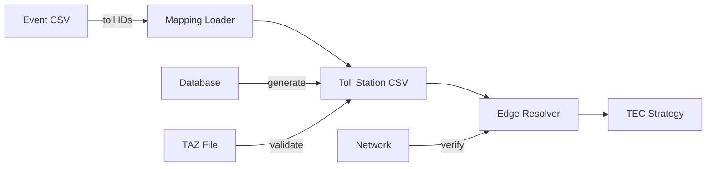

# Design Document: Toll Station Mapping Data

## Architecture Overview

The toll station mapping enhancement adds a data layer between event processing and TEC strategy generation, enabling automatic resolution of toll station references to SUMO network elements.

```
Event Data → Toll Mapping → Network Resolution → TEC Strategy
```

## Data Flow



## Key Design Decisions

### 1. CSV-Based Mapping (vs Runtime Database Queries)

**Decision**: Generate static CSV mapping file

**Rationale**:
- No runtime database dependency
- Faster lookup performance
- Version control friendly
- Easier debugging and validation
- Can be regenerated on schema changes

**Trade-offs**:
- Requires regeneration when data changes
- Additional file to maintain
- Potential staleness if not updated

### 2. Station Code Matching Strategy

**Decision**: Match last 3 digits of `station_code_js` to event toll IDs

**Rationale**:
- Event data uses abbreviated IDs (e.g., "250")
- Database uses full codes (e.g., "GS5123250")
- Last 3 digits provide unique identification
- Consistent pattern across routes

**Implementation**:
```python
def match_toll_id(station_code_js: str, event_id: str) -> bool:
    return station_code_js[-3:].lstrip('0') == event_id.lstrip('0')
```

### 3. Edge Resolution Hierarchy

**Decision**: Multi-level resolution with fallback

**Priority**:
1. TAZ-defined edges (most accurate)
2. Coordinate-based nearest edge (spatial matching)
3. Route-based default edges (fallback)

**Rationale**:
- TAZ provides verified mappings
- Coordinates handle non-TAZ stations
- Defaults ensure no failures

### 4. Data Structure Design

**CSV Schema**:
```
toll_station_id: string (primary key, matches event reference)
station_name: string (human readable)
square_code: string (database reference)
route_code: string (G5, G4202, etc.)
section_code: string (kilometer marker)
longitude: float (WGS84)
latitude: float (WGS84)
taz_id: string (optional, TAZ reference)
entrance_exit: string (entrance|exit|both)
edge_id: string (SUMO edge reference)
junction_id: string (optional, SUMO junction)
```

**Design Rationale**:
- Denormalized for fast lookup
- Self-contained (no joins needed)
- Human-readable for debugging
- Supports multiple use cases

## Integration Points

### 1. Scenario Generator Integration

**Location**: `shared/control_tools/scenario_generator.py`

**Changes**:
```python
class ScenarioGenerator:
    def __init__(self):
        self.toll_mapping = TollMappingLoader.load()

    def generate_tec_strategy(self, event):
        toll_ids = event.get('managed_toll_stations', '').split(',')
        edges = self.toll_mapping.resolve_edges(toll_ids)
        return self._create_tec_config(edges)
```

### 2. Utility Module

**New File**: `shared/utilities/toll_mapping_utils.py`

**Responsibilities**:
- Load and cache CSV mapping
- Resolve toll IDs to edges
- Validate edge existence
- Handle missing mappings

### 3. Event Injector Enhancement

**Location**: `shared/control_tools/event_injector.py`

**Enhancement**:
- Use toll mappings for TEC events
- Log resolution details
- Fallback handling

## Error Handling Strategy

### Missing Toll Station
- Log warning with toll ID
- Skip TEC generation for that station
- Continue processing other stations
- Report summary at end

### Invalid Edge ID
- Validate against network on load
- Log error for invalid edges
- Use route-level default if available
- Mark as validation failure

### Coordinate Mismatch
- Use configurable distance threshold (default 500m)
- Log stations beyond threshold
- Still assign if only candidate
- Flag for manual review

## Performance Considerations

### Loading Strategy
- Load once at startup
- Cache in memory
- ~37 stations = ~5KB memory
- Lookup O(1) with dict

### Validation Cost
- Network validation at generation time (not runtime)
- TAZ parsing once during generation
- No runtime performance impact

## Extensibility

### Future Enhancements

1. **Real-time Updates**
   - Watch database for changes
   - Regenerate mapping automatically
   - Hot reload without restart

2. **Multi-route Support**
   - Route-specific mapping files
   - Dynamic route detection
   - Cross-route validation

3. **Metadata Extension**
   - Queue lengths
   - Capacity limits
   - Operating hours
   - Dynamic pricing

### Version Migration

**v1 → v2 Migration Path**:
1. Add new fields as optional
2. Maintain backward compatibility
3. Deprecation warnings
4. Clean migration tools

## Testing Strategy

### Unit Tests
```python
def test_toll_id_matching():
    assert match_toll_id("GS5123250", "250")
    assert match_toll_id("GS5123050", "50")
    assert not match_toll_id("GS5123250", "251")

def test_edge_resolution():
    mapping = load_mapping("test_mapping.csv")
    edges = mapping.resolve_edges(["250", "255"])
    assert edges == ["-1232", "E15"]
```

### Integration Tests
- Load real CSV and resolve known stations
- Generate TEC strategy from event
- Validate against network file
- Check SUMO additional file syntax

### Validation Tests
- All G5 stations resolve correctly
- TAZ associations match
- Coordinates within network bounds
- No duplicate IDs

## Database Query Examples

### Extract Toll Stations
```sql
-- Get toll stations with coordinates
SELECT
    SUBSTRING(station_code_js FROM '.{3}$') as toll_id,
    station_name,
    square_code,
    route_code,
    section_code,
    longitude_84,
    latitude_84,
    entrance_exit_type
FROM dim.point_toll_84 t84
JOIN dim.point_toll_square sq ON t84.square_code = sq.code
ORDER BY route_code, section_code;
```

### Match with TAZ
```sql
-- Get TAZ associations
SELECT
    t.toll_id,
    m.taz_id,
    m.edge_id
FROM toll_stations t
LEFT JOIN dim.taz_demonstration_mapping m
    ON t.square_code = m.square_code;
```

## File Organization

```
events/
├── reference/
│   ├── toll_station_mapping.csv     # Generated mapping
│   ├── toll_mapping_metadata.json   # Generation metadata
│   └── validation_report.txt        # Validation results
├── all_extracted_events.csv         # Source events
└── scenarios/                       # Generated scenarios

shared/
├── utilities/
│   └── toll_mapping_utils.py        # New utility module
└── control_tools/
    ├── scenario_generator.py        # Updated
    └── event_injector.py           # Updated
```

## Risk Mitigation

| Risk | Mitigation |
|------|------------|
| Stale mapping data | Automated regeneration, version tracking |
| Missing stations | Graceful degradation, clear logging |
| Wrong edge assignment | Multi-level validation, manual review |
| Performance impact | Caching, pre-computation |
| Breaking changes | Feature flags, backward compatibility |

## Success Metrics

- 100% of G5 toll stations mapped correctly
- Zero runtime database queries for toll resolution
- <10ms lookup time per event
- 95% of events with toll stations generate valid TEC
- No regression in existing TEC strategies